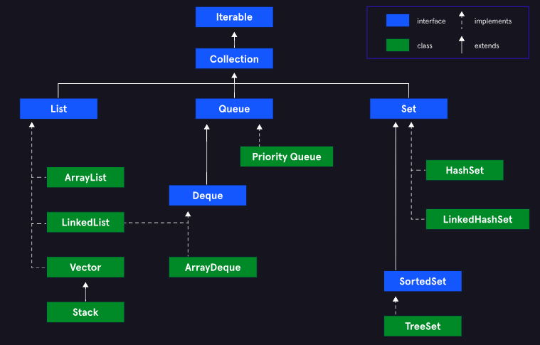

# Java Fundamentals and Best Practices [↑](../README.md)
- [I. Java I/O](#input-and-output-in-java-)
  - [Scanner Class](#the-scanner-class)
  - [FileReader and FileWriter Class](#filereader-and-filewriter-class)
- [II. Serialization](#serialization-in-java-)
  - [Serializable Interface](#the-serializable-interface-)
  - [Serializable Fields](#serializable-fields-)
  - [Serializing Reference Types](#serializing-associated-reference-type-fields-)
  - [Custom Serialization](#custom-serialization-)
- [III. Generics](#Generics-)
  - [Generic Interfaces](#generic-interfaces-)
  - [Generic Methods](#generic-methods-)
  - [Raw Types](#raw-types-)
  - [Multiple Type Parameters](#multiple-type-parameters-)
  - [Upper Bounds](#upper-bounds-)
  - [Wildcards](#wildcards-)
  - [Lower Bounds for Wildcards](#wildcard-lower-bounds)
- [IV. Collections](#collections-)
  - [`List` Core Interface](#1-list-interface-)
  - [`Set` Core Interface](#2-set-interface-)
  - [`Queue` Core Interface](#3-queue-interface-)
  - [`Dequeue` Core Interface](#4-dequeue-interface-)
  - [`Iterator` Interface](#5-iterator-interface-)
  - [`Collections` Interface](#6-collection-interface-)
  - [`Map` Interface](#7-map-interface-)
  - [Aggregate Operations](#aggregate-operations-)

## Input and Output in Java [↑](#java-fundamentals-and-best-practices-)

### The System class
- From the `java.lang` package.
- Static and cannot be instantiated.
- Has the following fields:
  - ``static PrintStream err``
  - ``static InputStream in``
  - ``static PrintStream out``

---
**NOTE:** 
- Everything that is  contained in the `java.lang` package is automatically imported into every 
  Java program.
- Every Java SDK comes with everything in the `java.base` module. This module is a collection of 
  resources that make Java what it is.
- The other packages contained in `java.base` are `java.util` and `java.io` provide helper 
  functionality that is not necessary to every program therefore has to be imported.
---

### The Scanner Class
- Predefined and built in Java.
- When a Scanner is declared, it needs to be told what type of input it is going to be scanning 
  which is passed through the constructor.

```java
import java.util.Scanner;

// Create a Scanner instance named "input".
// the input scanner takes System.in as type to be scanned.
Scanner input = new Scanner(System.in);
```

- The Scanner breaks up its input using a delimiter (whitespace by default).
- The Scanner acts as a **blocker**. It will block the continued execution of a program until it 
  gets its input.

#### Methods
##### `.next()`
| Variable | Code                                     |
|----------|------------------------------------------|
| String   | `String myString = input.next();`        |
| Int      | `int num = input.nextInt();`             |
| Double   | `Double numDouble = input.nextDouble();` |
| Byte     | `Byte numByte = input.nextByte();`       |
| Boolean  | `Boolean isTrue = input.nextBoolean();`  |
| Long     | `Long numLong = input.nextLong();`       |
| Short    | `Byte numShort = input.nextShort();`     |

#### `.hasNext()`
- Returns a `boolean` that indicates if there is another token left to process.

#### `.hasNextLine()`
- Returns a `boolean` that indicates if there is another line in the input of the defined scanner.

#### `.hasNextInt()`
- Returns a `boolean` that validates if there is another int in the input of the defined scanner.

#### `.useDelimeter(",")`
- Specify the delimiter for the scanner which is used to separate data units.
- Can be specially useful when a program is required to read CSV files.

### FileReader and FileWriter Class
- `FileReader` and `FileWriter` are two built-in input stream classes.
- Useful when working with external files containing text information.
- Throws `IOException` if something goes wrong during the Read/Write process.

```java
import java.io.FileReader;
import java.io.FileWriter;

String filePath = "C:/SampleFolder/input.txt";

// for FileReader
FileReader reader = new FileReader(filePath);

// for FileWriter
FileWriter writer = new FileWriter(filePath);

```

#### Reading a file
- FileReader has a method to validate content and read contents.

`.ready()`
- Make sures that there is a content to read in the buffer stream.

`.read()`
- Read the file one **character** at a time.

```java
import java.io.FileReader;

FileReader reader = new FileReader("C:/sampleFolder/input.txt");

public static void main(String[] args) {
  while (reader.ready()) {
    System.out.println((char) reader.read());
  }
  reader.close();
}
```

#### Writing to a File

```java
import java.io.FileWriter;

// Option 1
FileWriter output = new FileWriter("C:/SampleFolder/Output.txt");

// Option 2
String fileName = args[0];
File outputFile = new File(fileName);
FileWriter output2 = new FileWriter(outputFile);

```
- Will create a new file if it is not existing. Otherwise, will overwrite the file.
- This will not create a folder, and will throw a `FileNotFoundException` if the folder 
  structure is not existing.

`.write(String content, int startingIndex [optional], int numberOfChars [optional])`
- Writes the content to the writer object pointing to the file.

```regexp
output.write(statement);
output.write(statement, 0, 5);
```

#### Wrapping up Loose Ends
- It is critically important to close resources such as files and input streams.
- These can tie up memory in the processor and in some file systems only one asset can access a 
  file at a time, which blocks all access to the file from other sources.
- This can be done manually by adding `reader.close()` in the end or automatically using 
  `try-with-resources`.


## Serialization in Java [↑](#java-fundamentals-and-best-practices-)
One of the benefits of using objects is the ability to encapsulate state (or data) to use within 
a program.

**Serializing** objects stores an object's state in a file which can be transferred in a network.

### Serialization
- Taking an object's state and transforming it into a _stream of bytes_.
  - `Stream:` an abstract definition of a sequence of data that is made available over time.
  - `Byte:` 8 bit group of data
  - `Stream of Byte:` a sequence of bytes that is made available over time.
  
- To serialize an object, its fields and their types are stored in the form of bytes. These 
  bytes are then able to written to memory, a file, a database, or sent over a network with 
  all the information necessary to recreate the object.

### Deserialization
- Converts a stream of bytes back into an object.
- Using both serialization and deserialization gives the flexibility to persist objects and get 
  them back when needed.

---
`IMPORTANT!`
- The stream of bytes created from Serialization only includes the member variables of an object 
  and not its methods.
- Deserialization creates a copy of the original object. This copy shares the same state but is 
  an entirely new object in memory.

---

### The Serializable Interface [↑](#java-fundamentals-and-best-practices-)
- An interface describes the behavior a class.
- By having a class implement `Serializable` it can be serialized by the Java Virtual Machine (JVM).
- `Serializable` is a **market interface**. A marker interface provides run time information to 
  the JVM about the class and does not have any methods associated with it.
- It is important for the implementing class to provide a `serialVersionUID`.

```java
import java.io.Serial;
import java.io.Serializable;

public class Person implements Serializable {
  private String name;
  private int age;
  @Serial
  private static final long serialVersionUID = 1L;
}
```
The `serialVersionUID` acts as an identified for the JVM to choose the proper class to convert a 
stream of bytes back into an object.

### Serializable Fields [↑](#java-fundamentals-and-best-practices-)
- JVM defines a default way of serializing objects. This default **includes ignoring static class 
  fields** which belong to a class and not an object.
- JVM also serializes all fields in an object, even those marked `private` and `final`.
- A field marked as `transient` will have its value ignored during serialization and instead 
  receive the default value for that type of field.
- A static field belongs to the class and not to the object.

### Serializing Associated (Reference Type) Fields [↑](#java-fundamentals-and-best-practices-)
- For reference types to be serializable, they must also implement the `Serializable` interface.
- If a reference type does not implement serializable, a `NotSerializableException` is thrown.
- When JVM encounters a reference type, it will serialize the reference type first before trying 
  to serialize the encapsulating object.

### Custom Serialization [↑](#java-fundamentals-and-best-practices-)
```java
public class DateOfBirth {
  private int month;
  private int day;
  private int year;

  // constructors and getters
}

public class Person implements Serializable {
  private String name;
  private DateOfBirth dateOfBirth;

  private void writeObject(java.io.ObjectOutputStream stream) throws IOException{
    stream.writeObject(this.name);
    stream.writeInt(this.dateOfBirth.getMonth());
    stream.writeInt(this.dateOfBirth.getDay());
    stream.writeInt(this.dateOfBirth.getYear());
  }

  private void readObject(java.io.ObjectInputStream stream) throws IOException, ClassNotFoundException{
    this.name = (String) stream.readObject();
    int month = stream.readInt();
    int day = stream.readInt();
    int year = stream.readInt();
    this.dateOfBirth = new DateOfBirth(month, day, year);
  } 
}
```


### Methods
Below are the following methods used in conducting serialization and deserialization.

#### `FileOutputStream(String filePath)`
- Constructor method for `FileOutputStream` class.
- Helper method to write serialized object to a file.
- Establish a stream that points towards a certain file.
```java
FileOutputStream fileOutputStream = new FileOutputStream("fileName.txt");
```
----------
#### `ObjectOutputStream(FileOutputStream stream)`
- Constructor method for `ObjectOutputStream` class.
- Helper method to write serializable object to an output stream.

```java
ObjectOutputStream objectOutputStream = new objectOutputStream(fileOutputStream);
```
- `writeObject(Obj obj)`: serializes a passed object to a specified output stream.

----------

#### `FileInputStream(String filePath)`
- A constructor method for the `FileInputStream` class.
- Helper method used to read a file and loads it in a stream.

```java
FileInputStream fileInputStream = new FileInputStream("filename.txt");
```

----------
#### `ObjectInputStream(fileInputStream stream)`
- Constructor method for the ObjectInputStream class.
- Helps read a stream containing the serialized object in bytes.

```java
ObjectInputStream objectInputStream = new ObjectInputStream(fileInputStream);
```
----------
#### `.readObject()`
- Translate an ObjectInputStream instance to an object.
- `returns:` An Object that needs to be cast.

```java
Person michaelCopy = (Person) objectInputStream.readObject();
```

## Generics [↑](#java-fundamentals-and-best-practices-)
- Allows the creation of generic classes and methods by specifying a _type parameter_.

```java
public class Box<T> {
    private T data;
    
    //Constructor
    public Box(T data) {
        this.data = data;
    }
    
    //Getter
    public T getData() {
        return this.data;
    }
    
}
```
A simple generic `Box` class with a type parameter `T`. All class methods perform under this 
class performs around the `T`-type parameter.

```java
Box<String> myStringBox = new Box<>("Apple");
Box<Integer> myIntBox = new Box<>(3);
```

#### Good to know and Best practices
- Type parameter must be specified within the diamond operator `<>` after the `class` name.
- The type parameter `T`, is similar to a method parameter but instead receives a class or 
  interface type as an argument as opposed to a reference or primitive type.
- When defining a type parameter, it is best practice to make them single, uppercase letters to 
  be easily distinguished. By convention,
  - `E` : Elements
  - `K`: Key
  - `N`: Number
  - `T`: Type
  - `V`: Value
  - `S, U, V`: For multiple types
- Before Java7, the constructor for generic references are like `Box<String> myStringBox = new 
Box<String>("Apple");`
- Generic does not accept primitive types (int, short, long, byte, float, double, boolean, etc.).
  Therefore, a _Wrapper Class_ should be used instead.
- Avoid raw types implementation to avoid "incompatible type" errors.

#### Autoboxing
- Allows wrapper classes to take primitive values and convert them to their corresponding 
  wrapper object by automatically calling the `valueOf()` method.
- The value can also be converted back to its primitive type using `integerWrapper.intValue()`;

### Generic Interfaces [↑](#java-fundamentals-and-best-practices-)

```java
public interface Replacer<T>{
    void replace(T data);
}
```

- A generic interface is created like a generic class where the type parameter must be appended 
  to the interface name.
- Interface methods declaration are similar to non-generic interfaces and can include 
  non-generic methods as well.

#### Generic Classes implementing an Interface
```java
public class Box <T> implements Replacer<T> {
    private T data;
    
    @Override
    void replace(T data) {
        this.data = data;
    }
}
```

The code below shows the generic class that implements a generic interface is constructed.

```java
Replacer<Integer> boxReplacer = new Box<>();
```

#### Non-Generic Classes implementing an Interface
```java
public class StringBag implements Replacer<T> {
    private String data;
    
    @Override
    void replace(String data) {
        this.data = data;
    }
}
```

The code below shows how the non-generic class that implements a generic interface is constructed.
```java
Replacer<String> bagReplacer = new StringBag();
```

### Generic Methods [↑](#java-fundamentals-and-best-practices-)
- It is also possible to make a generic method instead of the whole class being generic.
- In creating a generic method, it is important to note that the generic type should be 
  indicated before the return type.

```java
public class StringBox {
  private String data;

  public /*static*/ <T> boolean isString(T item) {
    return item instanceof String; 
  }
  
  public static void main(String[] args) {
      StringBox box = new StringBox("test");
      box.isString(5); //returns false
  }
}
```
- The `isString()` method accepts a parameter of any type (T-type).
- The same format can also be done for static methods.

### Raw Types [↑](#java-fundamentals-and-best-practices-)
- Below is an example of a class being instantiated as a raw type.

```java
public class Box <T> {
  private T data;

  public Box(T data) {
    this.data = data; 
  }

  public T getData() {
    return this.data;
  }  
}

public static void main(String[] args) {
  Box box = new Box<>("My String");  // Raw type box
  String s2 = (String) box.getData();  // No incompatible type error
  String s1 = box.getData();  // Incompatible type error
}
```

- This implementation should be avoided due to the following reasons:
  - Avoid incompatible type errors.
  - Avoid potential runtime `ClassCastException` error when type-casting explicitly.
  - Generics give compile-time type checking, which helps detect bugs before code runs.
  - Generics helps when the JVM applies type erasures. 


### Multiple Type Parameters [↑](#java-fundamentals-and-best-practices-)
```java
public class Box <T, S> {
  private T item1;
  private S item2;
  // Constructors, getters, and setters
}
Box<String, Integer> wordAndIntegerBox = new Box<>("Hello", 5);
```

#### Interfaces and Methods
Multiple type parameters can also be done on interfaces and methods.
```java
public class Util {
    public static <T, S> boolean areNumbers(T item1, S item2) {
        return item1 instanceof Number && item2 instanceof Number;
    }
}
```

### Upper Bounds [↑](#java-fundamentals-and-best-practices-)
- When there is a need to restrict what class or interface could be used as a type argument.
- Restricts a generic type to be a specific type or any type that `extends` it.

```java
public class Box <T extends Number> {
    private T data;
}
```
A type parameter `T` was defined and added an upper bound type `Number` for `T`.

This means that `T` can be a `Number` or any of its subclasses (or interfaces).


#### Upper Bounds on Generic Methods
```java
public static <T extends Number> boolean isZero(T data) {
    return data.equals(0);
}
```

#### Multiple Bounded Parameter
It is also allowed to have multiple bounds implemented.

```java
public class Box <T extends Number & Comparable<T>> {
    private T data;
}
```
- A multiple bounds was imposed on `T` type parameter using the `&` operator.
- It is important to note that when defining multiple bounds, any upper bound that is a `class` 
  must come first followed by any interfaces.


### Wildcards [↑](#java-fundamentals-and-best-practices-)
- denoted by `?` symbol represents an unknown type.
- Makes the structure even more general and used when there is no need for a strict type checking.

```java
public class Util {
    
    public static void printBag(Bag<?> bag) {
        System.out.println(bag.toString());
    }
    
    public static void main(String[] args) {
        Bag<String> myBag1 = new Bag("Hello");
        Bag<Integer> myBag1 =  new Bag(23);
        Util.printBag(myBag1); // Hello
        Util.printBag(myBag2); // 23
    }
}
```

Wildcards can also have own upper and lower bounds.

```java
public static void printBag(Bag<? extends Number> bag) {
    System.out.println(bag.toString());
}
```

### Wildcard Lower Bounds
- Lower bound can also be had when working with wildcards.
- Restricts a wildcard to a class or interface **and any of its parent types**.

```java
public class util {
    public static getBag(Bag<? super Integer> bag) {
        return bag;
    }
} 
```
The type parameters allowed for this case is `Integer`, `Number`, or `Object`. 

When a `Boolean` type is used, this will result in an error.

#### Important Notes:
- Lower bounds can only be used for wildcards.
- A wildcard cannot have both upper and lower bounds.


#### Summary
- An upper bound wildcard should be used when the variable is being used to serve some type of 
  data to the code.
- A lower bound wildcard should be used when the variable is receiving data and holdting it for 
  later use.
- When a variable that serves data is used and only uses `Object` methods, an unbounded wildcard 
  is preferred.
- When a variable needs to serve data and store data for later use, use a type parameter instead 
  of a wildcard.


## Collections [↑](#java-fundamentals-and-best-practices-)
Collections Framework helps overcome the limits of an array and provide more complex functionality.

The collection framework provides data structures and algorithms, which perform common tasks on 
collections. This allows to focus on the important parts of the program and not on the low-level 
implementation details.

<div align="center">

</div>

The following are the **Core Interfaces** of the Collections Framework.

### 1. List Interface [↑](#java-fundamentals-and-best-practices-)
- In a `List`, elements are ordered in sequence. Allows the existence of duplicate elements and 
  fine-grain control over where elements are inserted in the sequence.
- Elements are index-based and has dynamic sizing.

#### Implementations
1. `ArrayList`: Overall preferred implementation since it is a dynamic array.
2. `LinkedList`: Performs better for cases where start and end changes happens frequently.

```java
List<Integer> intList = new ArrayList<>();
```
In this code snippet, the ArrayList implements the List.

#### Methods
- `.get(int index)`: retrieves an element based on the index.
- `indexOf(T element)`: Get the index where the element is located. Returns `-1` if non-existent.
- `.add(T element)`: Add an element to the list after the last element inside the list.
- `.add(int index, T element)`: Add an element to the list at a specified index.

---

### 2. Set Interface [↑](#java-fundamentals-and-best-practices-)
- A `Set` is a **collection of unique elements** and all of its methods ensure this stays true.

#### Implementations
1. `HashSet`: Best performance when retrieving or inserting elements but cannot guarantee any 
   ordering among them.
2. `TreeSet`: Does not perform well on insertion and deletion of elements but does keep the 
   elements stored in order based on their values (this can be customized).
3. `LinkedHashSet`: Slightly slower performance on insertion and deletion of elements than a 
   _HashSet_ but keeps elements in insertion order.

#### Methods
- `.add(T element)`:
  - Adds an element to the set. If there is an existing element in the Set, there 
  is no guaranteed ordering.
  - Returns a `true` if the element was successfully added, `false` if not.
  - Will return `false` if the element is already existing.
- `.contains(T element)`: Will return `true` if the element is already existing.

---

### 3. Queue Interface [↑](#java-fundamentals-and-best-practices-)
- `Queue` implements and behaves like the Queue data structure.

#### Implementations
1. `LinkedList`
2. `PriorityQueue`: Ensures the top element is the smallest relative to the data type's natural 
   ordering. (or some custom ordering policy provided)

```java
Queue<String> stringQueue = new LinkedList<>();
```

#### Methods
**Methods that throws an exception** (for dynamic sized queueing)
- `.add()`: Throws exception when there is no space for the element.
- `.remove()`: Throws exception when there are no elements to remove. Returns the element.
- `.element()`: Throws exception when there are no elements to get.

**Methods that return a special value** (for static sized queueing)
- `.offer()`: Returns `false` when there is no space for the element.
- `.poll()`: Returns `null` when there are no elements to remove.
- `.peek()`: Returns `null` when there ar eno elements to get.

---

### 4. Dequeue Interface [↑](#java-fundamentals-and-best-practices-)
- A type of `queue` that allows the access of elements from the **front and back** of the queue. 
  ("double-ended queue")

#### Implementations
1. `LinkedList`
2. `ArrayDeque`: Preferred implementation when needing to manipulate elements at the front and back.

#### Methods
**Methods that throws an exception**
- `.addFirst()` and `.addLast()`: Throws exception when there is no space to add the element.
- `.removeFirst()` and `.removeLast()`: Throws exception when there is no element to remove.
- `.getFirst()` and `.getLast()`: Throws exception when there is no element to get.

**Methods that return a special value**
- `.offerFirst()` and `.offerLast()`: 
  - Adds an element.
  - Returns `false` when there is no space to 
    add an element.
- `.pollFirst()` and `.pollLast()`: 
  - Removes an element. 
  - Returns `null` when there is no element to remove.
- `.peekFirtst()` and `.peekLast()`: 
  - Checks the next value but does not remove them.
  - Returns `null` when there is no element to get.

---

### 5. Iterator Interface [↑](#java-fundamentals-and-best-practices-)
Iterate through a collection (deque) from front to back.
```java
class collectionsDemo {
  public static void main(String[] args) {
    // Assuming `stringDeque` has elements front -> "Mike", "Jack", "John" <- back

    Deque<String> stringDeque = new ArrayDeque<>();
    stringDeque.addLast("Mike");
    stringDeque.addLast("Jack");
    stringDeque.addLast("John");

    Iterator<String> iterator = stringDeque.descendingIterator();

    while(iterator.hasNext()) {
      System.out.println(iterator.next());
    }
    // OUTPUT TERMINAL:  "John", "Jack", "Mike"
  }  
}
```
---

### 6. Collection Interface [↑](#java-fundamentals-and-best-practices-)
- The interface that keeps the Collections Framework polymorphic (compatible).
- The `Collection` interface provides a generic, general-purpose API **when a program needs a 
collection of elements** and **does not care about what type of collection it is**.
- Throws `UnsupportOperationException` when a `Collection` method is not implemented correctly.
- The parent of all the core interfaces.

#### Methods
- `.addAll(Collection collection)`: Adds all the element of a passed Collection argument.
- `.isEmpty()`: Returns `true` if the collection is empty.
- `.iterator()`: Returns an `Iterator` over the collection.
- `.size()`: returns the number of elements in the collection.
- `.stream()`: returns a `Stream` over the elements in the collection.
- `.toArray()`: returns an array with all elements in the collection.

#### Static Methods (Utility Methods)
- `.binarySearch()`: Performs a binary search over a `List` to find the specified object and 
returns the index if found. This method is also overloaded to also accept a `Comparator` to 
define a custom ordering policy. **Remember: The list must be sorted when performing a binary 
search**
- `.max()`: Returns the maximum element in the `Collection`. Accepts a `Comparator` (optional).
- `.min()`: Returns the minimum element in the `Collection`. Accepts a `Comparator` (optional).
- `.reverse()`: Reverses the order of elements in the `List` passed in as an argument.
- `.sort()`: Sorts the `List` passed in as an argument. Accepts a `Comparator` to define a 
  custom ordering policy.

---

### 7. Map Interface [↑](#java-fundamentals-and-best-practices-)
- A generic interface for an object that holds key-value pairs as elements.
- A _Key_ must be unique and maps only to one _Value_.
- Is not an extension of the Collection interface.

#### Implementations
1. `HashMap`: Defines no specific ordering for the keys and is the most optimized implementation 
   for retrieving values. **Fact: This is Java's implementation of a hash table.**

```java
Map<String, String> myMap = new HashMap<>();
```

#### Methods
- `.put(T key, S value)`: Sets the value that a key maps to. If the key is existing, it replaces 
  the current value with the new one.
- `.get(T key)`: Gets the value associated with the key. This does not remove the key-value pair.
  Returns `null` if the key is not in the `Map`.

---
### Aggregate Operations [↑](#java-fundamentals-and-best-practices-)
- Methods that apply transformations to a `Stream` of data.
- Usage of `Stream` to iterate through a `Collection` instead of using a for-loop and defining a 
  filter using manual IF conditions.

A `Stream` is a sequence of elements created from a `Collectionc` source. The `Stream` can be 
used as an input to a _pipeline (set of aggregate functions)_.

#### Pipeline Flow
1. **Aggregate Operations**: Transform an input `Stream` of byte.
2. **Intermediate Operations**: Accepts the output of Aggregate Operations as an input.
3. **Terminal Operation**: The final operation in the pipeline that produces a non-`Stream` output.

```java
List<Integer> evenList = intList.stream()
        .filter((number) -> number % 2 == 0)
        .map(evenNum -> evenNum*2)
        .collect(Collectors.toList());
```
- `.stream()` returns a sequential `Stream` with elements from the `intList`.
- `.filter()` is the _intermediate operation_.
- `.filter()` returns a `Stream` with elements that pass some filter condition.
- `.map()` returns a new `Stream` with elements that have had some method applied to them.
- `.map()` Transforms a `Stream` of elements by applying a method (lambda parameter) to all 
  elements in the stream. This will output a new `Stream` where the certain method was applied.
- `.collect()` is the _terminal operation_ which takes the `Stream` and collects the elements 
  back into some Container in its parameter.
- Java provides the `Collectors` class with `static` utility methods to use as an argument to 
  the `.collect()` method.


