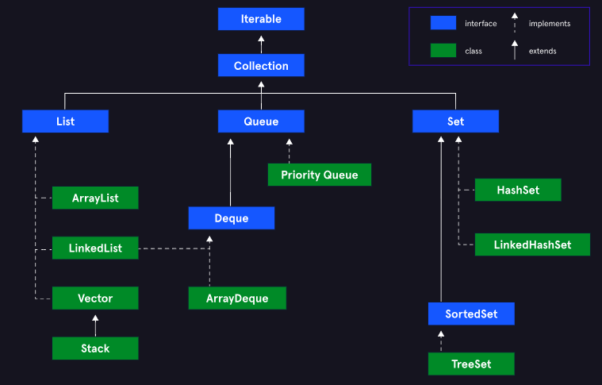

# Collections [↑](../../README.md#intermediate-java-fundamentals)

- [`List` Core Interface](#1-list-interface-)
- [`Set` Core Interface](#2-set-interface-)
- [`Queue` Core Interface](#3-queue-interface-)
- [`Dequeue` Core Interface](#4-dequeue-interface-)
- [`Iterator` Interface](#5-iterator-interface-)
- [`Collections` Interface](#6-collection-interface-)
- [`Map` Interface](#7-map-interface-)
- [Aggregate Operations](#aggregate-operations-)

-----

Collections Framework helps overcome the limits of an array and provide more complex functionality.

The collection framework provides data structures and algorithms, which perform common tasks on
collections. This allows to focus on the important parts of the program and not on the low-level
implementation details.

<div align="center">

</div>

The following are the **Core Interfaces** of the Collections Framework.

## 1. List Interface [↑](#collections-)
- In a `List`, elements are ordered in sequence. Allows the existence of duplicate elements and
  fine-grain control over where elements are inserted in the sequence.
- Elements are index-based and has dynamic sizing.

### Implementations
1. `ArrayList`: Overall preferred implementation since it is a dynamic array.
2. `LinkedList`: Performs better for cases where start and end changes happens frequently.

```java
List<Integer> intList = new ArrayList<>();
```
In this code snippet, the ArrayList implements the List.

### Methods
- `.get(int index)`: retrieves an element based on the index.
- `indexOf(T element)`: Get the index where the element is located. Returns `-1` if non-existent.
- `.add(T element)`: Add an element to the list after the last element inside the list.
- `.add(int index, T element)`: Add an element to the list at a specified index.

---

## 2. Set Interface [↑](#collections-)
- A `Set` is a **collection of unique elements** and all of its methods ensure this stays true.

### Implementations
1. `HashSet`: Best performance when retrieving or inserting elements but cannot guarantee any
   ordering among them.
2. `TreeSet`: Does not perform well on insertion and deletion of elements but does keep the
   elements stored in order based on their values (this can be customized).
3. `LinkedHashSet`: Slightly slower performance on insertion and deletion of elements than a
   _HashSet_ but keeps elements in insertion order.

### Methods
- `.add(T element)`:
    - Adds an element to the set. If there is an existing element in the Set, there
      is no guaranteed ordering.
    - Returns a `true` if the element was successfully added, `false` if not.
    - Will return `false` if the element is already existing.
- `.contains(T element)`: Will return `true` if the element is already existing.

---

## 3. Queue Interface [↑](#collections-)
- `Queue` implements and behaves like the Queue data structure.

### Implementations
1. `LinkedList`
2. `PriorityQueue`: Ensures the top element is the smallest relative to the data type's natural
   ordering. (or some custom ordering policy provided)

```java
Queue<String> stringQueue = new LinkedList<>();
```

### Methods
**Methods that throws an exception** (for dynamic sized queueing)
- `.add()`: Throws exception when there is no space for the element.
- `.remove()`: Throws exception when there are no elements to remove. Returns the element.
- `.element()`: Throws exception when there are no elements to get.

**Methods that return a special value** (for static sized queueing)
- `.offer()`: Returns `false` when there is no space for the element.
- `.poll()`: Returns `null` when there are no elements to remove.
- `.peek()`: Returns `null` when there ar eno elements to get.

---

## 4. Dequeue Interface [↑](#collections-)
- A type of `queue` that allows the access of elements from the **front and back** of the queue.
  ("double-ended queue")

### Implementations
1. `LinkedList`
2. `ArrayDeque`: Preferred implementation when needing to manipulate elements at the front and back.

### Methods
**Methods that throws an exception**
- `.addFirst()` and `.addLast()`: Throws exception when there is no space to add the element.
- `.removeFirst()` and `.removeLast()`: Throws exception when there is no element to remove.
- `.getFirst()` and `.getLast()`: Throws exception when there is no element to get.

**Methods that return a special value**
- `.offerFirst()` and `.offerLast()`:
    - Adds an element.
    - Returns `false` when there is no space to
      add an element.
- `.pollFirst()` and `.pollLast()`:
    - Removes an element.
    - Returns `null` when there is no element to remove.
- `.peekFirtst()` and `.peekLast()`:
    - Checks the next value but does not remove them.
    - Returns `null` when there is no element to get.

---

## 5. Iterator Interface [↑](#collections-)
Iterate through a collection (deque) from front to back.
```java
class collectionsDemo {
  public static void main(String[] args) {
    // Assuming `stringDeque` has elements front -> "Mike", "Jack", "John" <- back

    Deque<String> stringDeque = new ArrayDeque<>();
    stringDeque.addLast("Mike");
    stringDeque.addLast("Jack");
    stringDeque.addLast("John");

    Iterator<String> iterator = stringDeque.descendingIterator();

    while(iterator.hasNext()) {
      System.out.println(iterator.next());
    }
    // OUTPUT TERMINAL:  "John", "Jack", "Mike"
  }  
}
```
---

## 6. Collection Interface [↑](#collections-)
- The interface that keeps the Collections Framework polymorphic (compatible).
- The `Collection` interface provides a generic, general-purpose API **when a program needs a
  collection of elements** and **does not care about what type of collection it is**.
- Throws `UnsupportOperationException` when a `Collection` method is not implemented correctly.
- The parent of all the core interfaces.

### Methods
- `.addAll(Collection collection)`: Adds all the element of a passed Collection argument.
- `.isEmpty()`: Returns `true` if the collection is empty.
- `.iterator()`: Returns an `Iterator` over the collection.
- `.size()`: returns the number of elements in the collection.
- `.stream()`: returns a `Stream` over the elements in the collection.
- `.toArray()`: returns an array with all elements in the collection.

### Static Methods (Utility Methods)
- `.binarySearch()`: Performs a binary search over a `List` to find the specified object and
  returns the index if found. This method is also overloaded to also accept a `Comparator` to
  define a custom ordering policy. **Remember: The list must be sorted when performing a binary
  search**
- `.max()`: Returns the maximum element in the `Collection`. Accepts a `Comparator` (optional).
- `.min()`: Returns the minimum element in the `Collection`. Accepts a `Comparator` (optional).
- `.reverse()`: Reverses the order of elements in the `List` passed in as an argument.
- `.sort()`: Sorts the `List` passed in as an argument. Accepts a `Comparator` to define a
  custom ordering policy.

---

## 7. Map Interface [↑](#collections-)
- A generic interface for an object that holds key-value pairs as elements.
- A _Key_ must be unique and maps only to one _Value_.
- Is not an extension of the Collection interface.

### Implementations
1. `HashMap`: Defines no specific ordering for the keys and is the most optimized implementation
   for retrieving values. **Fact: This is Java's implementation of a hash table.**

```java
Map<String, String> myMap = new HashMap<>();
```

### Methods
- `.put(T key, S value)`: Sets the value that a key maps to. If the key is existing, it replaces
  the current value with the new one.
- `.get(T key)`: Gets the value associated with the key. This does not remove the key-value pair.
  Returns `null` if the key is not in the `Map`.
- `.keySet()`: Returns a `Set` containing the existing keys in the Map.

---
## Aggregate Operations [↑](#collections-)
- Methods that apply transformations to a `Stream` of data.
- Usage of `Stream` to iterate through a `Collection` instead of using a for-loop and defining a
  filter using manual IF conditions.

A `Stream` is a sequence of elements created from a `Collectionc` source. The `Stream` can be
used as an input to a _pipeline (set of aggregate functions)_.

### Pipeline Flow
1. **Aggregate Operations**: Transform an input `Stream` of byte.
2. **Intermediate Operations**: Accepts the output of Aggregate Operations as an input.
3. **Terminal Operation**: The final operation in the pipeline that produces a non-`Stream` output.

```java
List<Integer> evenList = intList.stream()
        .filter((number) -> number % 2 == 0)
        .map(evenNum -> evenNum*2)
        .collect(Collectors.toList());
```
- `.stream()` returns a sequential `Stream` with elements from the `intList`.
- `.filter()` is the _intermediate operation_.
- `.filter()` returns a `Stream` with elements that pass some filter condition.
- `.map()` returns a new `Stream` with elements that have had some method applied to them.
- `.map()` Transforms a `Stream` of elements by applying a method (lambda parameter) to all
  elements in the stream. This will output a new `Stream` where the certain method was applied.
- `.collect()` is the _terminal operation_ which takes the `Stream` and collects the elements
  back into some Container in its parameter.
- Java provides the `Collectors` class with `static` utility methods to use as an argument to
  the `.collect()` method.

