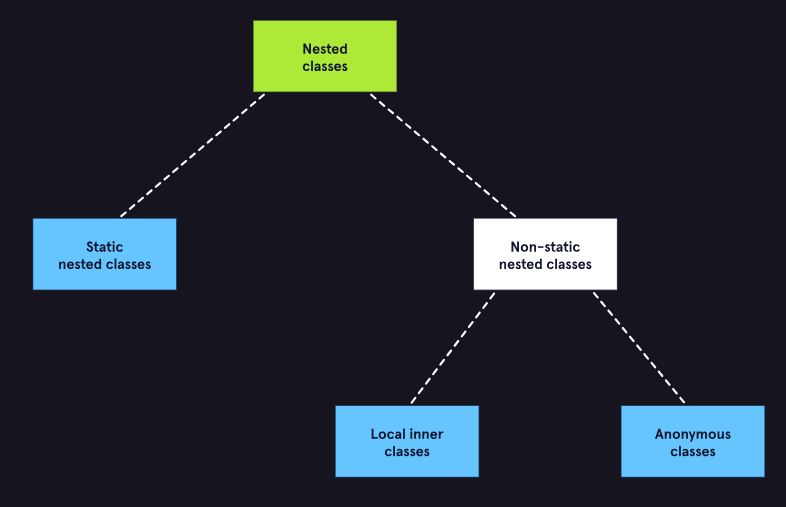

# Nested Classes in Java  [↑](../../README.md#intermediate-java-fundamentals)


## Nested Classes
- Classes that can be found within another class
- The process of a class being in another class is known as _Encapsulation_.
- Allows programmers to rationally organize and group classes that may be closely related in a Java program.

### Two types of Nested Classes
The type of nested class determines whether it has access to other elements (static and non-static) within its encapsulating class.

1. **Non-Static (Inner) Nested Classes**
   - Can have access to both static and non-static members of the class that it is declared within.
   - Closely associated with the class enclosing it. So to reference a non-static class outside its scope, the encompassing class must be referenced.
2. **Static Nested Classes**
   - Cannot access all classes, variables, and methods of the enclosing class.
   - It can only access static members of the encompassing class.
   - Does not have access to non-static members of the Java program.
   - Can be referenced without the association from the encompassing class.
   - Can define both static and non-static members of the encompassing class.

### Benefits of Implementing Nested Classes
- Provide an extra level of security by giving programmers the power to control the amount of access one class may have to another class and its methods.

<div align="center">

</div>


## Implementations

### Non-Static Nested Classes
Declaring a non-static nested class within an outer class
```java
class Outer {
  String outer;
  // Assign values using constructor
  public Outer(String name) {
    this.outer = name;
  }

  // private method
  private String getName() {
    return this.outer;
  }
    
  // Non-static nested class
  class Inner {
    String inner;
    String outer;
  }
}

```

#### To instantiate a non-static nested class
1. Instantiate the outer class.
```java
Outer outerClass = new Outer();
```

2. Instantiate the inner class
```java
Outer.Inner inner = outer.new Inner();
```

The code below shows an example of how a non-static class can access other static and non-static classes from the outer class.
```java
class Inner {
    String inner;
    String outer;
    
    public String getOuter() {
        outer = Outer.this.getName();
    }
}
```


### Static Nested Classes
Static nested classes are helpful because they allow related classes to be grouped under an enclosing class.

```java
class Toolbox{  
  public static String toolboxName = "Awesome Toolbox";
  public String ownerName;

  static class Saw{
    public void cut(){
      System.out.println("Cutting...");
    }
  }
    
  static class TapeMeasure{
    public void measure(){
      System.out.println("Measuring...");
    }
  }

  static class Wrench{
    public void tighten(){
      System.out.println("Tightening...");
    }

    public void loosen(){
      System.out.println("Loosening...");
    }
  }
}

```

The Toolbox's static members can be used as below:
```java
public class Main{
  public static void main(String[] args) {
    Toolbox.Saw petersSaw = new Toolbox.Saw();
    Toolbox.MeasuringTape amysMeasuringTape = new Toolbox.MeasuringTape();
    Toolbox.Wrench randomWrench = new Toolbox.Wrench();

    petersSaw.cut(); // output: Cutting...
    amysMeasuringTape.measure(); // output: Measuring...
    randomWrench.tighten(); // output: Tightening...
    }
}

```


## Shadowing
- Allows for overlapping scopes of members with the same name and type to exist in both a nested class and the enclosing class simultaneously.

```java
class Outer {
  String name = "string_1";

  // Nested inner class
  class Inner {
    String name = "string_2";

    public void printTypeMethod() {
      System.out.println(name);
      System.out.println(Outer.this.name);
    }
  }
}

class Main {
  // Main driver method
  public static void main(String[] args) {
    Outer outerObj = new Outer();
    Outer.Inner innerObj  = outerObj.new Inner();
    innerObj.printTypeMethod();
  }
}

// Output:
// string_1
// string_2
```

Using the keyword `this` along with the class name Outer, allows us to overlap the variable name with the contents of the outer class.


## Summary
- There are two main types of nested classes: non-static (also known as inner) nested classes, and static nested classes 
- Nested classes provide an extra level of security by giving programmers the power to control the amount of access one class may have to another class and its methods. 
- Non-static (inner) nested classes have the capability of accessing other static and non-static members whereas static nested classes may only access other static members of their enclosing class. 
- Shadowing refers to the practice of having variables and methods of the same name exist within nested classes. Shadowing results in overlap, and is managed using the keyword this to determine which version of the variable or method is being used.


