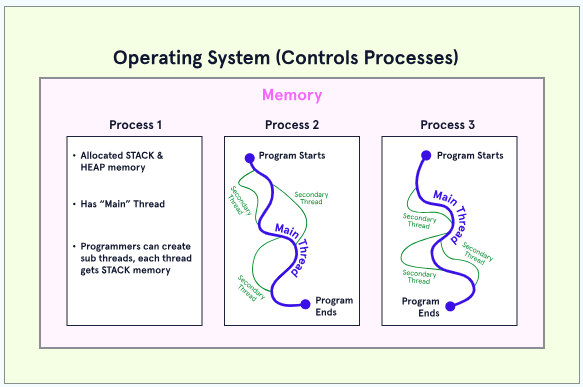

# Threading [↑](../../README.md#intermediate-java-fundamentals)
- [Introduction](#introduction-)
  - [When to use Threads](#when-to-use-threads)
  - [Context in Thread](#context-of-a-thread)
- [Thread Methods](#thread-methods-)
- [Implementations](#implementation-)
  - [1. Extending the `Thread` class](#1-extending-the-thread-class-)
  - [2. Implementing the `Runnable` Interface](#2-implementing-the-runnable-interface-)
    - [The Lambda Syntax](#lambda-expressions)
- [Supervising a Thread](#supervising-a-thread-)
- [Waiting for a Thread Completion](#waiting-for-a-thread-completion-)
- [Synchronization](#thread-synchronization-)
- [Thread Communications](#thread-communications-)

## Terms and Definitions: 

- **Sequential Programs:** Type of programs that run instructions in a defined order, with a beginning and an end. Only one instruction is being performed at a time.
- **Concurrent Programs:** Type of program the supports multiple flows of execution at the same time. Commonly implemented for fast and efficiency.

## Introduction [↑](#threading-)

### Thread
- The building blocks of concurrent programs or processes.
- A thread has a beginning and an end and only a single point of execution.
- Multi-threaded architecture and paradigm for programs is one of the most fundamental patterns in programming.

<div>

</div>

- On this diagram, we can see that a process can start and execute multiple threads.
- By default, a process has a single thread of execution called **main thread**. From this initial thread, more threads can be created to launch different independent tasks.
- The process is not considered to be complete until all the threads that has started are finished.
- When a thread completes execution, it joins back to the main thread.

### When to use threads
- Threads are best use when a program has tasks that need to be performed in parallel. It is required that the main thread remains responsive while tasks are being performed.
- When a program has the ability to perform more tasks in less time, the threading has increased its **throughput**.
- Threading can solve problem where there is a lot of waiting to be done. When one task is in a "waiting" or "blocked" state, another one can start.


### Context of a Thread
- For a program to execute properly, it needs to have several things in its **context**.
- A program's context includes variables, function names, a history of function calls (call stack), and more.
- There is a point where some information (context) needs to be shared between threads.
  - example, in an online store, there are several threads. Each thread will be using the product ID or user ID at some point which usually originates at the start of the application (main thread).
  - However, when multiple threads tends to read/update a single shared-resource, there is a risk of that resource being out-dated. This issue is handled through the use of **synchronization**.

## Thread Methods [↑](#threading-)

| Function                  | Description                                                                                                                                             |
|---------------------------|---------------------------------------------------------------------------------------------------------------------------------------------------------|
| `.isAlive()`              | Returns `true` if the thread is still running, and `false` if it has terminated.<br/> A supervisor might continuously poll this value until it changes. |
| `.setName(String name)`   | Set the name of the thread.                                                                                                                             |
| `.getName()`              | Returns the name of the supervisor thread                                                                                                               |
| `.sleep(int millisecond)` | Pause the execution of the thread for a given time in milliseconds.                                                                                     |
| `.join()` | Use to rejoin the Thread to its parent/main thread. Ensures that the thread is terminated before the next logic execution                               |


## Implementation [↑](#threading-)
There are multiple ways to implement threading in Java.

### 1. Extending the `Thread` Class [↑](#threading-)
- `java.lang.Thread` is a built-in class in Java that handles threads.
- To create a thread, a class is created. It is extended to the built-in Thread class.
- Once it is extended, the class overrides the `public void run()` method of the Thread class.
  - The `run()` method accepts no parameters and returns void as well.
  - If there is a need for a parameter, the fields of the class can be used. However, be very careful in utilizing the class fields as it may present some synchronization issues.
- When a class is defined this way, an instance of it can be created in any part of the program and call the `start()` to trigger the thread's execution.


```java
public class HugeProblemSolver extends Thread{

  public HugeProblemSolver(){
    // Required constructor used for passing information to the start() method.
  }

  private static void solveComputation(){
    // Solves random computation
    // Takes anywhere from 1 second to 10 minutes
  }

  @Override
  public void run(){
    solveComputation();
    System.out.println("The answer is: 42");
  }

  public static void main(String[] args){
    HugeProblemSolver m1 = new HugeProblemSolver();
    HugeProblemSolver m2 = new HugeProblemSolver();
    m1.start();
    m2.start();
  }
}

```

### 2. Implementing the Runnable Interface [↑](#threading-)
- A threaded class can be created in Java by implementing the `Runnable` interface.
- This is preferred since we are only allowed to extend one class and wasting it on a Thread might not be a beneficial approach to the program.

```java
public class Factorial implements Runnable {
 private int n;
 
 public Factorial(int n) {
   this.n = n;
 }
 
 public int compute(int n) {
   // ... the code to compute factorials
 }
 
 public void run() {
   System.out.print("Factorial of " + this.n + ":");
   System.out.println(this.compute(this.n));
 }
 
 public static void main(String[] args) {
   Factorial f = new Factorial(25);
   Factorial g = new Factorial(10);
   Thread t1 = new Thread(f);
   Thread t2 = new Thread(f);
   t1.start();
   t2.start();
 }
}
```
#### Lambda Expressions
- A more succinct way of using the `Runnable` interface is through the use of Lambda expressions.
- This is a more modern syntax that allows to define the run() method inline without requiring the class to implement `Runnable` or extend `Thread`.

```java
public class Factorial {
 public int compute(int n) {
   // ... the code to compute factorials
 }
 
 public static void main(String[] args) {
   Factorial f = new Factorial();
   
   // the lambda function replacing the run method
   new Thread(() -> {
     System.out.println(f.compute(25));
   }).start();
 
   // the lambda function replacing the run method
   new Thread(() -> {
     System.out.println(f.compute(10));
   }).start();
 }
}
```

- This syntax has several benefits:
  - The class no longer needs to extend `Thread` OR implement `Runnable`. Thread can be created from anything.
  - The class no longer needs a constructor to store arguments since it can be passed as an argument directly into the compute function when the Thread is created.
  - The class is easier to read. The lambda syntax makes it so that readers can immediately identify what is being performed without having to read through the class first.

## Supervising a Thread [↑](#threading-)
- Sometimes there is a need to see the status of threads during their execution. In Java, the best pattern for this situation is using a **supervisor thread**.
- This is a pattern where the main thread (or another thread) is able to watch and check on the progress of another thread, as long as it has access to the corresponding Thread instance.
- Supervisor threads are often used for updating the user of the program on the progress of an ongoing task.

```java
import java.time.Instant;
import java.time.Duration;
 
public class Factorial{
 public int compute(int n){
   // the existing method to compute factorials
 }
 
 // utility method to create a supervisor thread
 public static Thread createSupervisor(Thread t){
   Thread supervisor = new Thread(() -> {
     Instant startTime = Instant.now();
     // supervisor is polling for t's status
     while (t.isAlive()) {
       System.out.println(Thread.currentThread().getName() + " - Computation still running...");
       Thread.sleep(1000);
     }
   });
 
   // setting a custom name for the supervisor thread
   supervisor.setName("supervisor");
   return supervisor;
 
 }
 
 public static void main(String[] args){
   Factorial f = new Factorial();
 
   Thread t1 = new Thread(() -> {
     System.out.println("25 factorial is...");
     System.out.println(f.compute(25));
   });
 
 
   Thread supervisor = createSupervisor(t1);
 
   t1.start();
   supervisor.start();
 
   System.out.println("Supervisor " + supervisor.getName() + " watching worker " + t1.getName());
 }
}
```
In this example, the Thread named `supervisor` is polling the status of the `t1` worker thread.


## Waiting for a Thread Completion [↑](#threading-)
Another common scenario in a multi-threaded programs is to wait for a thread to complete before proceeding.

**Other term:** _awaiting_, _blocking_,

**Java term:** **join**

This is done using the `.start()` and `.join()` method of the Thread class. 


## Thread Synchronization [↑](#threading-)
When accessing the same data from two different thread, a _race condition_ may occur

- **Race Condition** occurs when some inconsistency is caused by two threads trying to access the same shared data at the same time.

### Preventing the Race Condition
Race conditions can be prevented using the `synchronized` keyword in Java. 
When this keyword is added, it will ensure that for a given instance of a class, only one thread can run that method at a time.

```java
public synchronized void incrementElement(int i, int j) {
    array[i] += j;
}
```

## Thread Communications [↑](#threading-)
In Java, to control thread execution from within other threads, the following methods are used:
- `.wait()`: Block the execution of the current thread
- `.notify()`
- `.notifyAll()`: Allow other threads to check their condition again and proceed.

These are primarily used to protect shared resources from being used by two threads at the same time or to wait until some condition 
has changed in a thread.

### `synchronized(this)` block
When a `synchronized(this)` block is created, we are telling Java that we want it to be the only thread accessing the fields of the class at a given moment.

In this block, we must:
1. Check the condition on which to wait.
2. Decide whether to `wait()` or `notifyAll()`.

```java
import java.lang.Thread;
 
public class OrderDinnerProcess {
 private boolean foodArrived = false;
 
 private void printTask(String task) { 
   System.out.println(Thread.currentThread().getName() + " - " + task);
 }
 
 public void eatFood() {
   printTask("Wow, I am starving!");
   try {
     synchronized (this) {
       while (!this.foodArrived) {
         printTask("Waiting for the food to arrive...");
         wait();
       }
     }
   } catch (InterruptedException e) {
     System.out.println(e);
   }
   printTask("Finally! Yum yum yum!!!");
 }
 
 public void deliverFood() {
   printTask("Driving food over...");
   try {
     Thread.sleep(5000);
     synchronized (this) {
       this.foodArrived = true;
       printTask("Arrived!");
       notifyAll();
     }
   } catch (InterruptedException e) {
     System.out.println(e);
   }
 }
 
 public static void main(String[] args) {
   OrderDinnerProcess p = new OrderDinnerProcess();
   try {
     for (int i = 0; i < 5; i++) {
       Thread eatFood = new Thread(() -> p.eatFood());
       eatFood.start();
     }
     Thread.sleep(1000);
     Thread delivery = new Thread(() -> p.deliverFood());
     delivery.start();
   } catch (InterruptedException e) {
     System.out.println(e);
   }
 }
}

```
- In this example, a family of five eager to eat some dinner is simulated. However, they cannot eat until the food has arrived.
- The `synchronized` block is used to tell Java that only one thread should be able to read from and write to the `foodArrived()` field at a time.
- The `wait()` function is used to pause execution for a thread until a call has been made to `notifyAll()`, which triggers another check of the condition.
- The `notifyAll()` function is used to tell al threads that are currently waiting that they may now proceed.
- In addition to being used to coordinate thread execution, we can use the `synchronized(this)` block, `wait()`, and `notifyAll()` to control access to shared resources. 
If a resource is currently in use, a thread should `wait()` until a call to `notifyAll()` is made, which indicates that the shared resource may have been released and is ready for use.

## Thread Lifecycle [↑](#threading-)
A thread normally exists in one of the five states throughout its lifecycle.

1. New
2. Running or Active
3. Blocked
4. Waiting
5. Terminated or Joined


