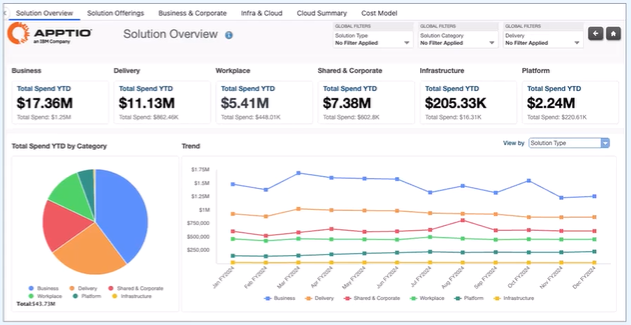

# IT Financial Management Level 1
- IT Financial Management (ITFM) talks about strategic IT spend enabling smarter decisions.
- The biggest challenge for ITFM is data. Data is scattered all throughout which creates missed opportunities.

## IT Financial Management (ITFM)
- The practice of analyzing, planning, and optimizing the costs and investments of IT to ensure financial transparency,
alignment of all IT spending with business objectives, and to communicate the value of IT to the business.
- Drives insights across organization. Improve cost visibility, prioritize investments, and communicate values.

## IBM Apptio
- The right data, in the right context, at the right time, in front of the right people.
- Identify cost reduction opportunities
- Align IT spend with business objectives.
- Effortless data integration with other technologies.
  - Unified integration of IT financial and operational data.
  - Direct ingestion of raw data. Pull data directly from the source and IBM Apptio will connect.
  - Automated data preparation

### Smart Reporting
Intelligent reports to drive strategic IT spend decisions.
- Identify areas for cost reduction.
- Accelerate planning and forecasting cycles
- Enhance accountability with stakeholders
- Align IT spend to business objectives and priorities
- Accelerate digital transformation

## IBM Targetprocess
- Enables organizations to dynamically plan and manage work, resources, agile programs, and portfolios while ensuring
all are continuously aligned to strategy.
- Enables organizations to:
  - align across the business
  - maximize productivity and efficiency
  - Accelerate decision-making

### Core Solutions
1. **Strategic Planning** - Business & IT Leaders
    - Align portfolios, programs, and execution to business objectives.
2. **Portfolio Planning** - Product Leaders
    - Connect strategy with execution for continuous delivery
3. **Resource Management** - PMO & Engineering Teams
    - Optimize resource allocation across teams, portfolios and programs
4. **Financial Management** - Portfolio Leaders
    - Connect portfolio decisions with financial planning and cost management

### Strategic Portfolio Management
Connects strategy to execution by ensuring resources, investments, and initiatives are aligned with business goals
to deliver measurable outcomes.

#### Key Components
- **Portfolio visibility:** Holistic view of all investments, projects, and initiatives across the organization
- **Alignment to strategy:** Prioritize work with business goals and KPI
- **Capacity planning:** Allocate funding, talent, and assets to the most impactful initiatives
- **Agile execution/scaling:** Bridge strategy and delivery by connecting portfolios to scale/execute frameworks like SAFe.

## ITFM vs TBM

### ITFM
- Focus in on the budget
- Involves the financial management of IT-specific expenditures
- Covers 4 key pillars:
  - Costing
  - Planning
  - Billing
  - Benchmarking

### Technology Business Management (TBM)
- Represents an evolution beyond ITFM
- Incorporates broader disciplines such as FinOps (Cloud Financial Operations) and SPM
- Aims to manage total IT costs across the enterprise
- Aligns IT investments with business outcomes and value

