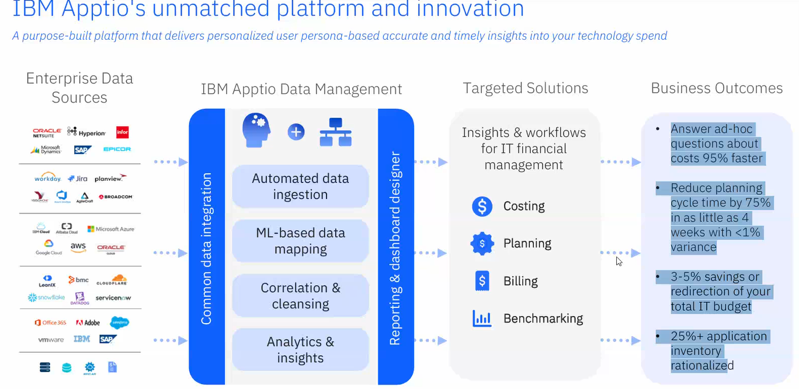

# IBM Apptio

- `MIPS:` Millions of Instructions Per Second
- `MSU:` Millions of Service Units
- `ITFM:` IT Financial Management

## Introduction
- IBM Apptio is more than another data solution. It is the leading ITFM platform delivering actionable business intelligence.
- **Reduce Cost**
  - Identify cost reduction opportunities.
  - Identify cost optimization opportunities
  - Reduce waste and duplication

## Understanding Mainframe Cost
Mainframes remain integral to enterprise operations and are best for modern workloads

- in `IBM Z`, **Z** means Zero downtime

