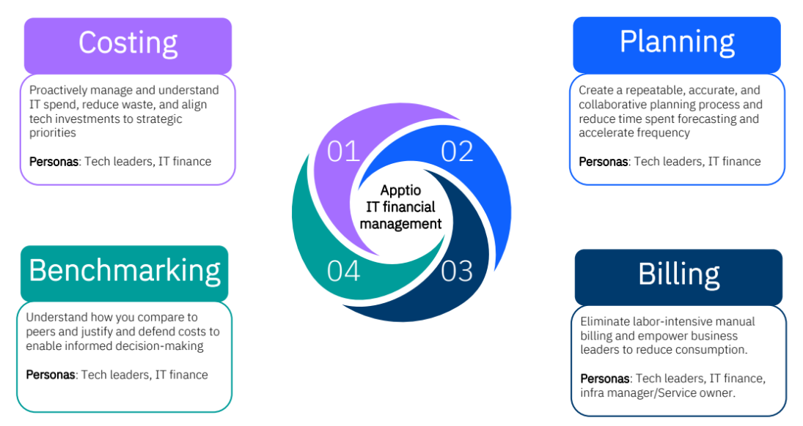
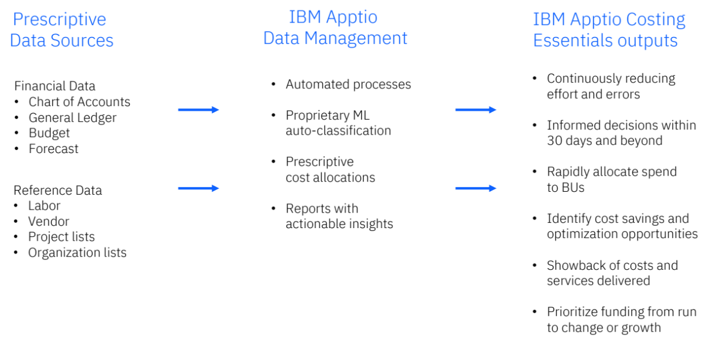

# IBM Apptio Level 2

## Apptio Portfolio

## IBM Apptio Costing Essentials
- Delivers **foundational cost transparency** of IT spend and rapid, actionable insights into the business value delivered.
- Use the power of a standardized model to **clearly and accurately articulate costs**.
- Translate IT costs to business value
- Automatically classify key spend drivers
- Benchmark actuals across cost categories
- Surface IT spend per business unit.

### Key Use Cases
- Understand IT spend
- Communicate IT spend
- Track cloud and infrastructure spend
- Manage workforce spend
- Manage & rationalize solution portfolio using prescriptive TCO
- Manage vendor spend
- Understand solution composition (TCO)
- Understand investments & comparison to peers

### Apptio Costing Standard
Elevate IT investment strategies through automated, granular, and unrestricted allocations.

1. **Optimize application TCO**
    - Lower the cost of specific application by understanding the associated fully burdened cost structure
2. **Rationalize application & service portfolio**
    - Lower the cost of application and service portfolio by identifying and eliminating duplications and underutilized application
3. **Manage business unit consumption**
    - Partner with BU leaders to achieve their business objectives with the most cost-effective IT solution

## IBM Apptio Planning

### IT Planning
- Strategic alignment foster innovation, enhance decision-making, promotes adaptability to change, and facilitates collaboration between IT and other functions.
- Process of aligning IT's objectives and strategic goals to the overall business.
- Facilitating innovation while delivering to reduce costs and drive strategic outcomes.
- Continuous IT budgeting, forecasting, and budget analysis.

### IBM Apptio Planning Essentials
- A streamlined and single pane of glass approach to faster, more effective IT financial planning.
- Enhances accuracy and confidence in decision-making to identify opportunities to shift spend towards high-priority investments.

1. **Accelerate budget planning & forecasting**
    - Automate tasks and collaborate as a team to create budgets and forecasts faster
2. **Optimize labor planning**
    - Align labor resources with business objectives by identifying gaps between budgeted headcount and actuals.
3. **Surface actionable insights**
    - Run variance analysis to understand and address the reasons behind identified gaps, such as budget overspend, unplanned expenses, or project delays.

#### Features
1. Collaborative financial planning & forecasting
2. Accelerate budgeting and forecasting cycles
3. Customizable reporting and analytics
4. Manage vendor contracts and fixed assets
5. Conduct variance analysis
6. Make informed labor decisions
7. Automate continuous planning cycles

#### Key Use Cases
1. Process digitalization & simplification
2. Budgeting or planning
3. Re-forecasting
4. Standardized reporting

## IBM Apptio Billing Essentials
- Apptio Billing Essentials is a **simple, prescriptive chargeback solution** for cost transparency and accountability.
- Provides visibility to IT spend
  - **Simple chargeback:** Charge business unit consumers for the service they consume to increase transparency and accountability.
  - **Easy rate managementL:** Influence demand and change consumption behavior. Set rates based on unit costs from Apptio costing
  - **Automated bill generation:** Easily send bills for efficient cost recovery. 
  - **Current period reconciliation and adjustment:** Ensure that bills accurately reflect consumption
  - **Basic compliance and audit support:** Keep data for easy access
  - Annual rate setting and monthly billing:

## IBM Apptio Benchmarking

### IT Benchmarking
- Comparing the costs, performance, and outcomes of organization with others in the industry or geo.
- Using the comparative data to assess whether you are performing above, on-par, or below.
- Implementing strategies based on benchmark findings.

### IBM Apptio Benchmarking
- Self-service peer comparisons of technology spend over time.
- Enables an ongoing process for tracking performance, validating decisions, and identifying areas for improvement.

1. **Track:** Continually monitor actuals against industry benchmarks and track improvement efforts
2. **Validate:** Gain insight into IT performance against peer with like-to-like comparisons based on industry standard frame
3. **Identify:** Understand where you stand in comparison to peers and identify areas of improvement and risks.  

#### IBM Apptio Benchmarking Types
1. **Industry Spend & Labor:** IT Spend as a % of revenue
2. **IT tower & cost pool:** Software Cost as a % of IT Cost
3. **Infra cost & efficiency:** Server Unit Cost

## IBM Labor Financial Management