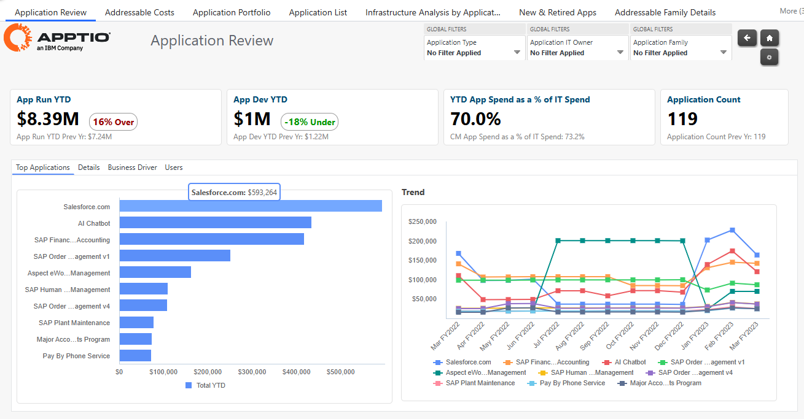
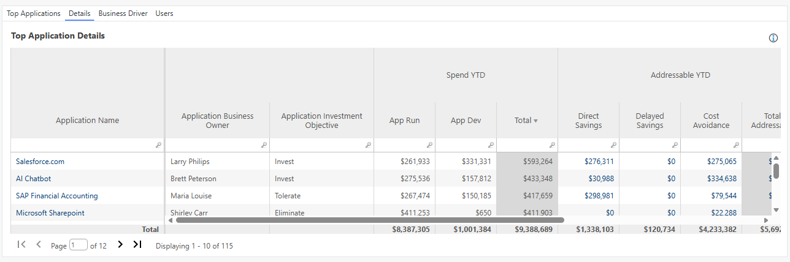
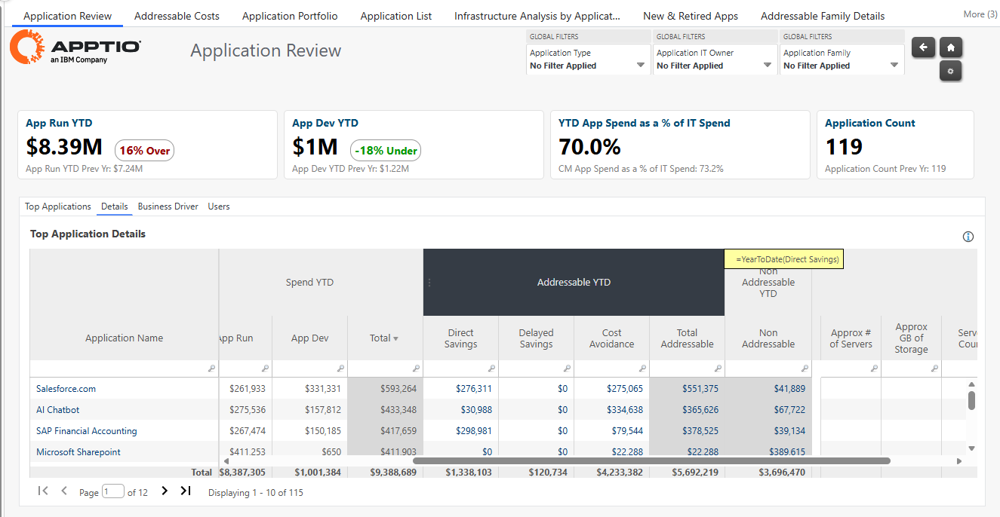
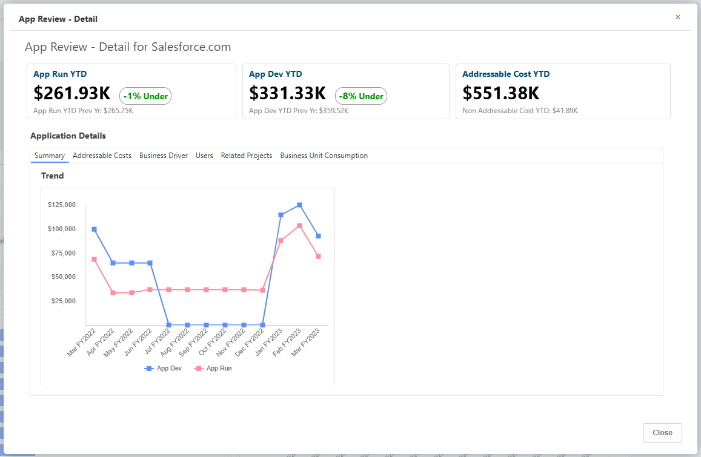
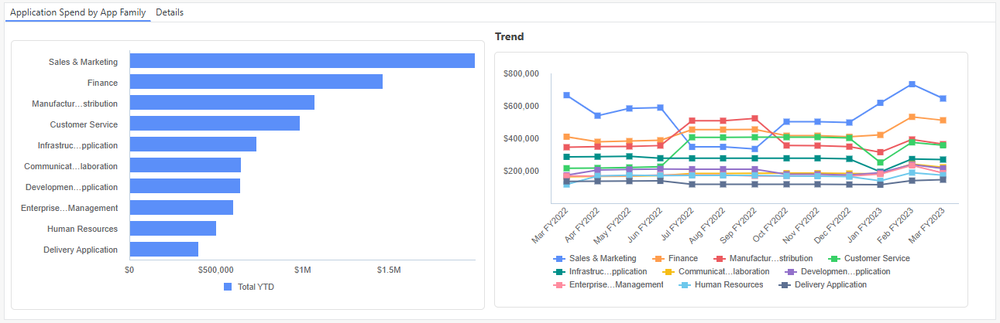
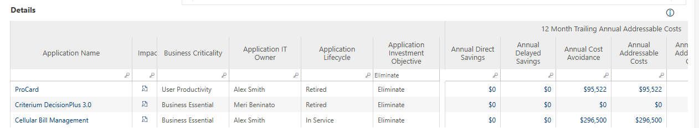
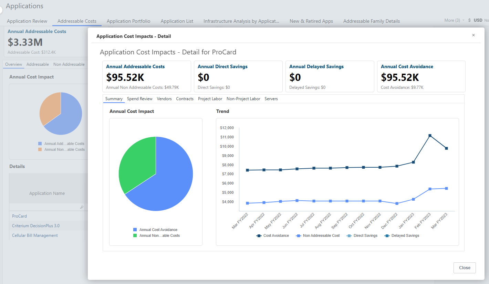
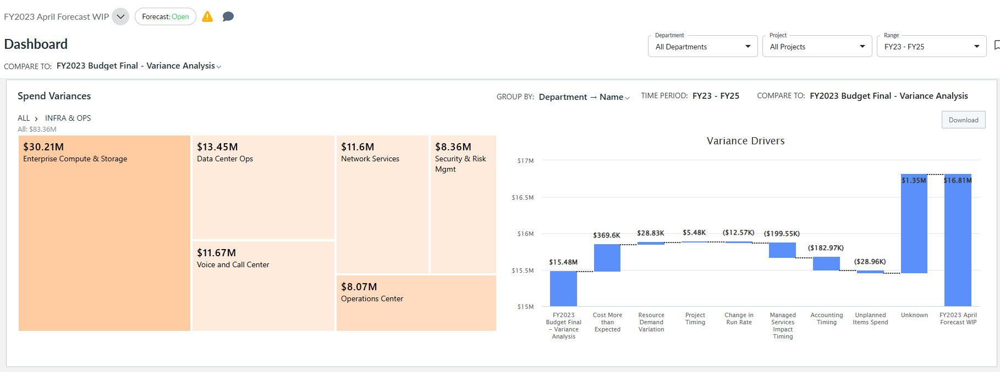

# IBM Apptio Level 3

## Terms and Definition
- `Cost center:` A built-in dimension to reference data that aligns with cost objects in a budget plan.
- `Budget:` A financial expression of an organization's fiscal year plan, which is divided into monthly increments.
- `Department:` A section within an organization that contributes to or supports the company's overall mission and goals.
Departments are centered on the IT organization and represent the basic structure of the IT organization in budgeting and reporting rollup.
Departments should align with Cost Centers, but this is not a requirement.
- `Actuals:` Actual costs incurred per month.
- `Addressable:` Costs and spending that can be controlled in the short term.
- `Non-addressable:` Spending that takes longer to analyze than addressable costs and spending.
- `Direct savings:` Savings that can be directly tied to specific goods or services.
- `Delayed savings:` Forgoing immediate spending to achieve better long-term results.
- `Cost avoidance:` A strategy that prevents a business or organization from spending unnecessary money in the future.

## Apptio Costing Standard

### Top Applications

- In this Apptio demo environment, the client has most IT spend on Salesforce.

### Details
Where Application business owners are and Application Investment objectives are shown

#### Gartner Time Model
Categorizing investments as **tolerate**, **invest**, **migrate**, **eliminate**.

#### Addressable Spend
The addressable spend is the spending that can be looked at in the next six months to a year.

#### App Review - Details
Provides robust information about the application selected.

- The `Addressable Costs` tab allows a client to quickly see the percentage of the addressable cost as: **Cost Avoidance YTD**, **Direct Savings YTD**, **Non-Addressable Cost YTD**.
- This is where **Delayed Savings** can be seen if there are any. 
- The `Business Driver` tab allows client to look at the trailing 12-month **Average Annual Unit Cost** for the application.
- The `Users` tab shows information on Application User Count and **Average Annual Spend Per User** and **Average Monthly Spend per User**
- The `Related Projects` tab shows the projects that are related to the selected (Salesforce.com) application along with their status and associated cost.
- The `Business Unit Consumption` tab shows which groups consume the application and influencing the business.

### Application Spend by App Family

### Addressable Costs Review
- This section looks at addressable costs which are those items that the company can directly influence and adjust.
- These cost can impact the cost structure within the next year.
- There are different types of addressable costs such as Direct Savings (e.g. Cloud infrastructure that can be turned off)

#### Cost Avoidance
Select a certain business unit and filter the Application Investment Objective to 'Eliminate'. Click the impact button to see the addressable cost impact if that application is retired.

### IBM Apptio Costing Standard demonstration summary
- The demonstration showcases how the IBM Apptio Costing Standard can help clients translate data-driven insights to optimize their costs and fund innovation.
- By using Apptio Costing Standard's rich reporting capabilities, learners were able to visualiza the application's spend.
- Individual Business Units were examined to understand which departments used the application and ifthey maximized their use of the application.
- Direct Savings are examined. A direct savings scenario that is explored shutting down part of the cloud infrastructure. The Apptio Costing Standard showed the effectiveness of this scenario.

## IBM Apptio Planning Standard

### Spend Variance Table
- The budgets are color-coded, which means it quickly shows how budgets are being managed.
- Orange represents the groups are over budget.
- Gray means underbudget.
- 

