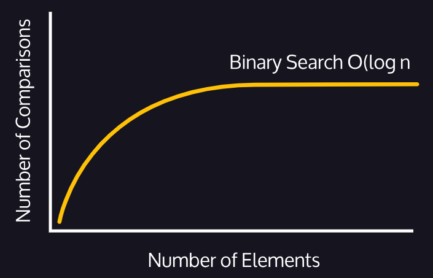

# Binary Search
- Searching a certain
- Requires sorted data-set.

<div align="center">

</div>

### Algorithm:
1. Check the middle value of the dataset.
   - If this value matches the target, return the index.
2. If the middle value is less than the target, redo *step 1* using the right side of the list.
3. Repeat this idea until a single value is located.
4. If the remaining value is not the same with the target, this means that the value to be searched does not exist.

### Time Complexity of Binary Search
- The time complexity of a binary search is `O(log N)`.

``` 
A sorted list of 64 elements will take at most
log2 (64) = 6 comparisons.
```

<div align="center">
   
</div>

