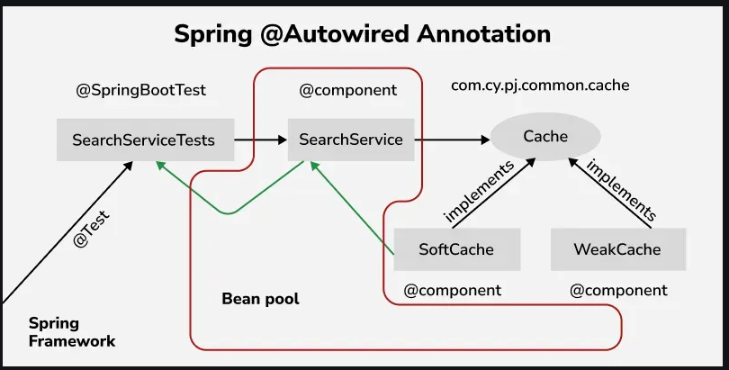

# `@Autowired` Annotation [↑](../../../README.md#iii-spring-annotations)
- Marks a constructor, setter method, property, or configuration method to be autowired. This means that Spring will automatically inject the required dependencies (beans) at runtime using its DI mechanism.
- Can be declared by Java configuration or XML configuration.

<div align="center">

</div>

## Enabling the `@Autowired` annotation

### Java-Based Configuration

```java
package com.gfg.demo.config;

import com.gfg.demo.domain.Customer;
import com.gfg.demo.domain.Person;
import org.springframework.context.annotation.Bean;
import org.springframework.context.annotation.Configuration;

@Configuration
public class AppConfig {
    @Bean
    public Person person(){
        Person person = new Person();
        person.setName("ganesh");
        person.setAge(21);
        return person;
    }
}
```

### XML-Based Configuration
```xml
<?xml version="1.0" encoding="UTF-8"?>
<beans xmlns="http://www.springframework.org/schema/beans/"
        xmlns:xsi="https://www.w3.org/2001/XMLSchema-instance"
        xsi:schemaLocation="http://www.springframework.org/schema/beans/
        https://www.springframework.org/schema/beans/spring-beans.xsd
        http://www.springframework.org/schema/context/
        http://www.springframework.org/schema/context//spring-context.xsd"
        xmlns:context="http://www.springframework.org/schema/context/"
        >

    <context:annotation-config/>
    <bean id="customer" class="com.gfg.demo.domain.Customer">
        <property name="type" value="1" />
    </bean>

    <bean id="person" class="com.gfg.demo.domain.Person">
        <property name="name" value="ganesh" />
        <property name="age" value="21" />
    </bean>
</beans>
```

## `@Autowired` in Action
After enabling the `@Autowired` annotation and deciding on what configuration to use. The beans can be wired via constructor, properties, or setter method.

For example, there are two (2) POJO classes Customer and Person. The Customer has a dependency on Person class.

```java
@Component

public class Customer {
    private int type;
    private Person person;
    
    // Constructors

    // getters and setter

}

public class Person {
    private String name;
    private String age;
    
    // Constructors

    // getters and setters

}
```

### Constructor-based Autowiring
Optional for constructor based injection. Here, the person object from the container is passed to the constructor while creating the Customer object.
```java
@Component
public class Customer {

    private int type;
    private Person person;

    public Customer() {
    }

    @Autowired
    public Customer(Person person) {
        this.person = person;
    }
}
```

### Property-based Autowiring
The person object will be injected into the property person at run time.
```java
@Component
public class Customer {
    private int type;
    
    @Autowired
    private Person person;
}
```

### Setter-based Autowiring
```java
@Autowired
public void setPerson(Person person) {
    this.person = person;
}
```

## Exceptions
If the bean of type Person is not defined, then Spring will throw the `NoSuchBeanDefinitionException`. This will prevent Spring Container from launching successfully by throwing:
```text
org.springframework.beans.factory.NoSuchBeanDefinitionException: No qualifying bean of type  'com.gfg.demo.Person' available: 
expected at least 1 bean which qualifies as  autowire candidate. Dependency annotations: {@org.springframework.beans.factory.annotation.Autowired(required=true)}
```

### Possible solution

```java
@Autowired(required=false)
private Person person;
```


