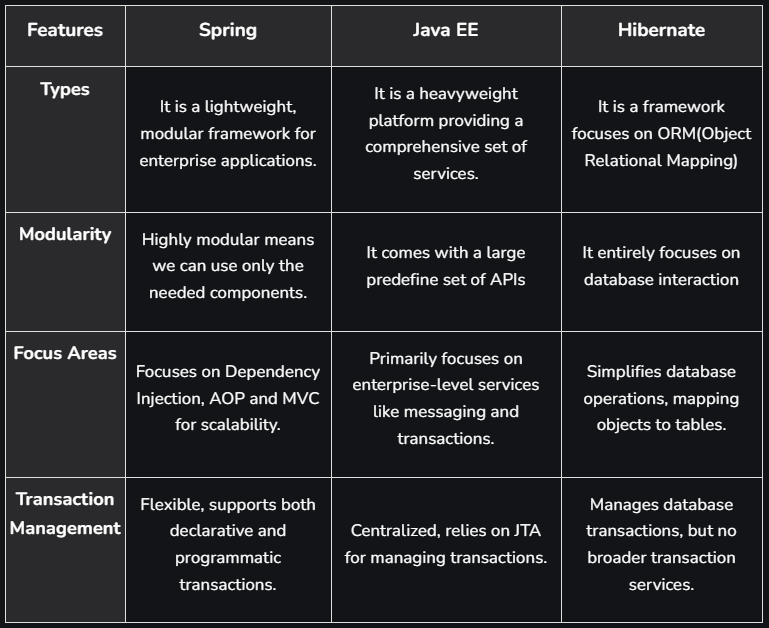

# Introduction to Spring Framework [↑](../../../README.md#spring-framework)

- [I. Key Features](#key-features-of-spring-framework-)
- [II. Concepts](#concepts-of-spring-framework-)
  - [Dependency Injection](#1-dependency-injection-)
  - [IoC Containers](#2-inversion-of-control-ioc-container-)
  - [Annotations](#3-spring-annotations-)
- [III. Modules](#spring-framework-modules-)
- [IV. Comparison](#spring---jee---hibernate-)
- [V. Miscellany](#how-spring-web-application-works-)

## Introduction [↑](#introduction-to-spring-framework-)
- Spring is an open-source Java framework that is useful for building RESTful web applications.
- Spring focuses on project "scaffolding" so that developers can concentrate on the core logic of applications.
- Contains templates for many different kinds of applications
  - **Spring Cloud**
  - **Spring Web Services**
  - **Spring Security**
  - **Spring Boot**
  - etc.

## Benefits of using Spring [↑](#introduction-to-spring-framework-)
- **Simplified Development:** Reduces boilerplate code with features like Dependency Injection and AOP.
- **Loose Coupling**: Dependency injections ensures components are loosely coupled.
- **Modular:** Spring's modular architecture allows the use of only the required components, improving flexibility and testability.
- **Integration Support:** Spring provides built-in support for various technologies like JDBC, JMS, and JPA.
- **Scalability**

## Key Features of Spring Framework [↑](#introduction-to-spring-framework-)

1. **Dependency Injection**
   - A design pattern where the Spring container automatically provides the required dependencies to a class instead of the class creating them itself.
   - Promotes loose coupling, easier testing and better maintainability by decoupling the object creation and usage.
   - Spring framework provides an IoC container which is responsible for managing dependencies.
   - Spring manages the lifecycle of beans, including initialization, destruction, and scopes (e.g. singleton, prototype, request, session)
2. **Aspect-Oriented Programming (AOP)**
   - Allows developers to modularize cross-cutting concerns (such as logging, security, and transaction management) from the business logic.
   - These concerns can be applied across multiple components without modifying the business logic.
   - Spring AOP uses advice, pointcuts, and aspects to implement cross-cutting concerns. For example, ASOP can be used to log method execution times or enforce security checks.
3. **Transaction Management**
   - Consistent abstraction for managing transactions across various databases and message services.
4. **Spring MVC**
   - Powerful framework for building web applications that follow the Model-View-Controller pattern.
5. **Spring Security**
   - Provides comprehensive security features including authentication, authorization and protection against common vulnerabilities. 
6. **Spring Data**
   - Simplifies database access by providing easy-to-use abstractions for working with RDB and non-RDB.
7. **Spring Batch**
   - Framework in Spring for handling large-scale batch processing, such as reading, processing and writing data in bulk.
8. **Integration with Other Frameworks**
   - Spring integrates seamlessly with other technologies like Hibernate, JPA, JMS and more.

## Concepts of Spring Framework [↑](#introduction-to-spring-framework-)

### 1. Dependency Injection [↑](#introduction-to-spring-framework-)
- Design pattern used in software development to implement Inversion of Control.
- Allows class to receive its dependencies from an external source rather than creating them within the class.

#### Types of Dependency Injection

- **Constructor Injection:** The dependent object is provided to the class via its constructor. The dependencies are passed when an instance of the class is created.
- **Setter Injection:** The dependent object is provided to the class via a setter method after the class is instantiated.
- **Field Injection:** The dependent object is directly injected into the class through its fields without explicit constructor or setter methods. One example is via `@Autowired` annotations.

### 2. Inversion of Control (IoC) Container [↑](#introduction-to-spring-framework-)
- A design principle in Object-Oriented Programming (OOP).
- The control of object creation and dependency management is transferred from the application code to an external framework or container.
- Reduces complexity of managing dependencies manually and allows more modular and flexible code.

#### The BeanFactory IOC Container
- Simplest container and is used to create and manage beans.
- Initializes beans lazily (only when needed).
- Typically used for lightweight applications where the overhead of `ApplicationContext` is not required.

```java
Resource resouce = new ClassPathResource("beans.xml");
BeanFactory factory = new XmlBeanFactory(resource);
MyBean obj = (MyBean) factory.getBean("myBean");
```
- `ClassPathResource()` loads the beans.xml file from the classpath.
- `XmlBeanFactory` creates a basic IoC container using that XML.
- `getBean("myBean")` retrieves and creates the bean with ID _myBean_.

#### The ApplicationContext IOC Container
- An advanced container that extends BeanFactory and provides additional features like internationalization support, event propagation, and AOP support.
- Preferred mostly because of its enhanced features.

```java
ApplicationContext context = new ClassPathXmlApplicationContext("beans.xml");
MyBean obj = (MyBean) context.getBean("myBean");
```

### 3. Spring Annotations [↑](#introduction-to-spring-framework-)
- Are metadata used by the Spring Framework to define configuration, dependencies, and behavior directly in Java code.
- Allow Spring to automatically detect, create and manage beans at runtime using component scanning and reflection.
- Below are some common annotations that are key for managing Spring IoC container and defining dependencies:
  - `@Component:` Marks a class as a Spring bean allowing Spring to automatically detect and mange it during classpath scanning.
  - `@Autowired:` Automatically injects dependencies into a class. Can be used on fields, constructors, or methods allowing Spring to resolve and inject the required beans.
  - `@Bean:` Defines a Spring bean explicitly within a configuration class. This is used to create and configure beans that are not automatically detected by classpath scanning.
  - `@Configuration:` Indicates that a class contains bean definitions and acts as a source of bean configuration. It is used to mark a class as a configuration class that contains methods annotated by `@Bean` to define beans.

## Spring Framework Modules [↑](#introduction-to-spring-framework-)
The Spring framework consists of seven modules. These modules provide different platforms to develop different enterprise applications.

### Core Container
#### 1. Spring Core Module:
- Core component providing the IoC container for managing beans and their dependencies.

#### 2. Spring Beans
- Provides the `BeanFactory` which is the basic building block of the IoC container. The BeanFactory is the core interface for accessing the IoC container which provides method for retrieving beans.
- contains the `BeanWrapper` which is responsible for managing the lifecycle of a bean.

#### 3. Spring Context
- Provides the `ApplicationContext` which is an advanced version of `BeanFactory`.
- Provides additional features such as internationalization and resource loading, and the ability to **publish** and **consume** events.

#### 4. Spring Expression Language (SpEL)
- Provides powerful expression language for querying and manipulating objects during runtime.
- Supports wide range of features including property access, method invocation, conditionals, loops, and type conversion.
- Provides support for accessing variables and functions defined in the application context.
- Provides support as well for defining custom functions and variables.
- 
### 5. Spring Application Context Module:
- Builds on the Core module.
- Offering enhanced features like internationalization, validation, event propagation and resource loading via the `ApplicationContext` interface,

### 6. Spring AOP Module:
- Implements the AOP to handle cross-cutting concerns like transaction management, logging and monitoring, using aspects defined with the `@Aspect` annotation.

### Data Access/Integration
For integrating with databases and other data sources.

#### 1. Spring JDBC
- JDBC abstraction layer that reduces the amount of boilerplate code required to work wth JDBC.
- Spring JDBC supports transaction management, allowing to manage database transactions declaratively using Spring's transaction management.

#### 2. Spring ORM (Object-Relational Mapping)
- Provides APIs for database interactions using ORM frameworks like JDO, Hibernate and iBatis.
- Simplifies transaction management and exception handling with DAO support.
- Provides integration with ORM frameworks such as Hibernate and JPA.
- Provides higher-level abstraction layer on top of ORM frameworks.
- Less boilerplate code and more easily integrate ORM technologies with other Spring features such as transaction management and caching.

#### 3. Spring Data
- Provides consistent and easy-to-use programming model for working with data access technologies including DBs, No-SQL, and cloud-based data services.
- Provides wide range of features such as automatic CRUD operations, query generation from method names.
- Provides support for pagination and sorting, integration with Spring's transaction management, and more.
- Supports common data access patterns, such as repositories and data access objects (DAOs).

#### 4. Spring Transaction
- Provides support for declarative transaction management in Spring applications.
- Support for various transaction propagation and isolation level allowing management of transactions at different level of granularity.
- Provides support for different transaction management strategies such as JTA transaction manager or a simple JDBC transaction manager.

### 5. Spring DAO Module:
- Provides data access support through JDBC, Hibernate or JDO, offering an abstraction layer to simplify database interaction and transaction management.


### Web
For building web applications.

#### 1. Spring MVC
- Provides MVC framework for building web applications.
- Support for handling HTTP requests and responses, form handling, data binding, validation, and more.
- Provides support for JavaServer Pages (JSP)m Thymeleaf, and Velocity, allowing developers to choose the view technology that best suits their needs.

#### 2. Spring WebFlux
- Provides reactive programming model for building web applications that require high concurrency and scalability.
- Support for reactive data access, reactive stream processing, and reactive HTTP clients.

#### 3. Spring Web Services
- For building SOAP-based and REST-ful web services.
- Support for generating WSDL (Web Services Description Language) from Java classes, and generating Java classes from WSDL.
- Allows developers to define the contract (i.e. the interface) of their web service using WSDL.

### 4. Spring Web MVC Module:
- Implements the MVC architecture to create web applications.
- Separates model and view components, routing requests through the `DispatcherServlet` to controller and views.

### Miscellaneous

#### 1. Spring Security
- Authentication and Authorization features for Spring applications.
- Role-based access control and expression-based access control.

#### 2. Spring Integration

#### 3. Spring Batch

#### 4. Spring Cloud

## Spring - JEE - Hibernate [↑](#introduction-to-spring-framework-)




## How Spring Web Application works [↑](#introduction-to-spring-framework-)
1. Client sends a GET request to the Spring Web Server (the Spring application).
2. The server sends data request to the data store to retrieve the information requested by the client.
3. The data store sends the requested data back to the server, if available.
4. The server sends the data (HTTP Response) back to the client and displays it on the browser.

## Making GET requests with a web browser
- Done using the `@GetMapping` annotation.

## Making GET requests with Curl
- Curl is short for _Client for URLs_.
- A command line tool that allows to transfer data to and from a server. It supports multiple protocol including HTTP.


```shell
curl http://www.mypetclinic.com/dogs/
```

## Making POST requests with a web browser
- Done using the `@PostMapping` annotation.

## Making a POST requests with curl

```shell
curl -X POST -d "{\"name\":\"Charlie\", \"breed\":\"German Shepherd\"}" -H "Content-Type: application/json" http://www.mypetclinic.com/dogs/ 
```

- The `-X POST` tells the server that the client is making a POST request. Where `-x` is the curl parameter specifying the type of request method to use.
- The `-d` (short for `--data`) indicates to the server that the client is sending a new data to an existing application.
- The `-H "Content-Type: application/json` specifies that the data is sent in JSON format.
- Finally, the URL `http://www.mypetclinic.com/dogs/` tells the server where to send the new data.

-------------
`NEXT TOPIC:` [Spring Architecture](1_2_spring-architecture.md)