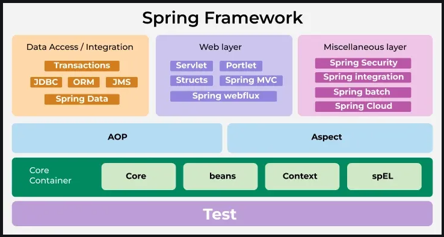

# Spring Architecture [↑](../../../README.md#spring-framework)
The architecture of Spring Framework is designed around two core principles:
1. Dependency Injection (DI)
2. Aspect Oriented Programming (AOP)

Spring framework architecture is based on the principles of **modularity**, **separation of concerns**, and **flexibility**.
Reducing unnecessary overheads and complexity in the application. 
Additionally, Spring framework's flexible configuration model allows developers to configure the application using various approaches such as **XML-based**, **Java-based**, and **Annotation-based** configuration.

## Dependency Injection [↑](#spring-architecture-)
[//]: # (TODO: Update accordingly)

## Aspect Oriented Programming (AOP) [↑](#spring-architecture-)
[//]: # (TODO: Update accordingly)
