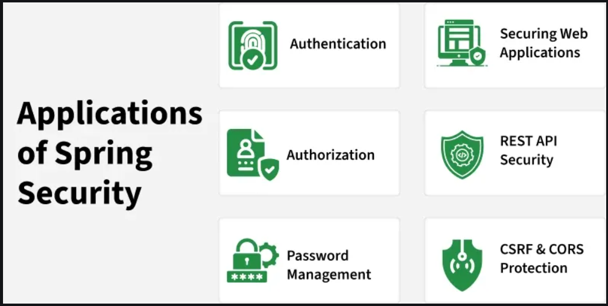

# Introduction to Spring Security [^](../../../README.md#spring-framework)
- **Spring Security framework** is used to secure Java applications by handling **authentication** and **authorization**.
- Integrates smoothly with Spring Boot making it easy to apply security configurations with minimal setup.
- Protects applications from common security threats.
  - Verifies user identity and controls access based on roles and permissions.
  - Provides built-in security against attacks like **Cross-Site Request Forgery (CSRF)**, **session fixation**, and **clickjacking**.
  - Supports both annotation-based and Java-based configuration for customizing security rules.

### Password Management
- Supports modern password encoding mechanism such as **bcrypt**.
- Provides built-in utilities for hashing and verifying passwords.

### Method-Level Security
Secure specific methods in the application using annotations:
- `@PreAuthorize`
- `@PostAuthorize`
- `@Secured`

### Support for Modern Security Standards
- **JSON Web Tokens (JWT)** for stateless authentication
- **OAuth2** and **OpenID Connect** for SSOs
- **LDAP** for enterprise authentication

### Advantages of Spring Security
- Protection against threats like CSRF, session fixation, and clickjacking.
- Integration with Spring MVC and Spring Boot.
- Supports Java-based configuration
- Works with standard Servlet API.
- Prevents brute-force attacks
- Active open-source community ensuring continuous improvements.

-----------
`NEXT TOPIC:`[Important Terms in Spring Security](2_Important-terms.md)