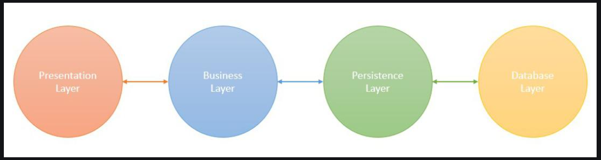
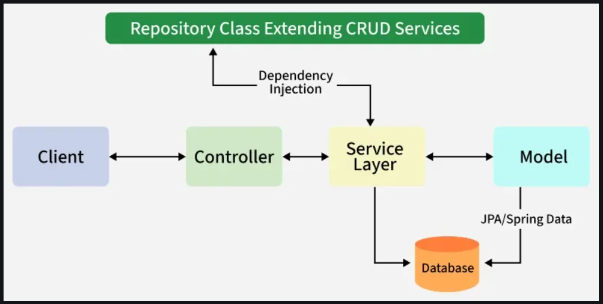

# Introduction to SpringBoot [↑](../../../README.md#iv-spring-boot)
- Spring Boot provides a ready-to-use, production-grade framework on top of Spring.
- It eliminates boilerplate configuration, comes with an embedded server and focuses on rapid development.
- Built on top of conventional Spring framework, providing all the features of Spring while being significantly easier to use.


## Feature of Spring Boot

### 1. Auto-Configuration
- Automatically configures components (like Hibernate, JPA) based on dependencies. No need for manual XML setup.

### 2. Easy Maintenance for Creation of REST endpoints
- With annotations like `@RestController`, `@GetMapping`, and `PostMapping`, creating REST endpoints is straightforward.

```java
@RestController
@RequestMapping("/api")
public class MyController {
    @GetMapping("/hello")
    public String sayHello() {
        return "Hello, World!";
    }
}
```

### 3. Embedded Tomcat Server
- Also supports Jetty and Undertow, offering flexibility for different application needs.

### 4. Easy Deployment
- Spring Boot applications can be packaged as JAR or WAR files and deployed directly to servers or cloud environments.
- As of 2025, it offers seamless integration with Docker and Kubernetes for easier cloud-native deployment and scaling.

### 5. Microservice-Based Architecture
- Spring Boot is well-suited for microservice architecture, where applications are split into independent, modular services.


## Applications of Spring Boot

1. Enterprise Applications
2. Cloud-Native Applications
3. Real-Time Applications for reactive programming
4. Batch Processing Applications for ETL, report generation and large data processing

## Spring Boot Architecture

### Spring Boot Architecture Layers
<div align="center"></div>

#### 1. Presentation Layer
- Handles HTTP requests through REST Controllers.
- Manages authentication, request validation and JSON serialization/deserialization
- Forwards processed requests to the Business Layer for further logic.

#### 2. Business Layer
- Responsible for implementing the application's core logic.
- Consists of service classes that:
  - Process and validate data.
  - Handler authentication and authorization (integrating Spring Security if needed)
  - Apply transaction management using `@Transaction`
  - Interact with the Persistence Layer to store or retrieve data.

#### 3. Persistence Layer
- Manages database transactions and storage logic.
- Consists of repository classes using **Spring Data JPA**, **Hibernate** or **R2DBC** for data access.
- This layer is responsible for:
  - Mapping Java objects to database records using ORM frameworks.
  - Managing CRUD
  - Supporting relational and NoSQL databases.

#### 4. Database Layer
- Contains the actual database where the application data is stored.
  - **Relational Databases:** MySQL, PostgreSQL, Oracle, SQL server
  - **NoSQL Databases:** MongoDB, Cassandra, DynamoDB, Firebase
  - **Cloud-bassed databases for Scalability**

### Spring Boot Flow Architecture
<div align="center"></div>