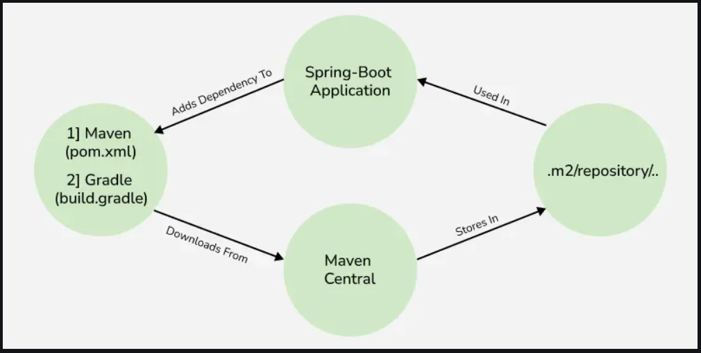

#### `PREVIOUS TOPIC:` [Application Properties](2_application-properties.md)
---------

# Spring Boot - Dependency Management [↑](../../../README.md#iv-spring-boot)
- At the heart of Spring Boot is the Dependency Management feature.
- Is a way of managing all the required dependencies in one place and efficiently making use of them.

## Importance of Dependency Management
- **Centralized Dependency Management:** All dependencies are managed in one place (pom.xml, build.gradle)
- **Automatic Version Management:** When the Spring Boot version is updated, the versions of all related dependencies are automatically updated.
- **Conflict Prevention:** Helps prevent version conflicts between different libraries, especially in multi-module projects.

## Life Cycle of Dependency Management

<div align="center"></div>

## Spring Boot Starters
Are set of convenient dependency descriptors provided by Spring Boot that simplify the setup of application by grouping commonly used libraries and configurations 
into a single, reusable module.

### Type of Starters
1. **Application Starters** - For building specific types of applications (e.g. spring-boot-starter-web).
2. **Technical Starters** - For technical features like logging or security (e.g. spring-boot-starter-security).
3. **Production-ready Starters** - For monitoring and managing production applications (e.g. spring-boot-starter-actuator).

## Implementation

### Using pom.xml

```xml 
<?xml version="1.0" encoding="UTF-8"?>
<project xmlns="https://maven.apache.org/POM/4.0.0" xmlns:xsi="https://www.w3.org/2001/XMLSchema-instance"
         xsi:schemaLocation="https://maven.apache.org/POM/4.0.0 https://maven.apache.org/xsd/maven-4.0.0.xsd">
    <modelVersion>4.0.0</modelVersion>
    
    <parent>
        <groupId>org.springframework.boot</groupId>
        <artifactId>spring-boot-starter-parent</artifactId>
        <version>3.4.3</version>
        <relativePath/> <!-- lookup parent from repository -->
    </parent>
    
    <groupId>sia</groupId>
    <artifactId>GFG</artifactId>
    <version>0.0.1-SNAPSHOT</version>
    <name>GFG</name>
    <description>GFG Application</description>
    
    <properties>
        <java.version>17</java.version>
    </properties>
    
    <dependencies>
        <!-- Spring Boot Starter Web for building web applications -->
        <dependency>
            <groupId>org.springframework.boot</groupId>
            <artifactId>spring-boot-starter-web</artifactId>
        </dependency>
        
        <!-- Spring Boot Starter Thymeleaf for rendering views -->
        <dependency>
            <groupId>org.springframework.boot</groupId>
            <artifactId>spring-boot-starter-thymeleaf</artifactId>
        </dependency>
        
        <!-- Lombok for reducing boilerplate code -->
        <dependency>
            <groupId>org.projectlombok</groupId>
            <artifactId>lombok</artifactId>
            <optional>true</optional>
        </dependency>
        
        <!-- Spring Boot Starter Test for unit testing -->
        <dependency>
            <groupId>org.springframework.boot</groupId>
            <artifactId>spring-boot-starter-test</artifactId>
            <scope>test</scope>
        </dependency>
        
        <!-- Spring Boot DevTools for enhanced development experience -->
        <dependency>
            <groupId>org.springframework.boot</groupId>
            <artifactId>spring-boot-devtools</artifactId>
            <scope>runtime</scope>
            <optional>true</optional>
        </dependency>
    </dependencies>

    <build>
        <plugins>
            <!-- Spring Boot Maven Plugin for packaging the application -->
            <plugin>
                <groupId>org.springframework.boot</groupId>
                <artifactId>spring-boot-maven-plugin</artifactId>
                <configuration>
                    <excludes>
                        <!-- Exclude Lombok from the packaged application -->
                        <exclude>
                            <groupId>org.projectlombok</groupId>
                            <artifactId>lombok</artifactId>
                        </exclude>
                    </excludes>
                </configuration>
            </plugin>
        </plugins>
    </build>
</project>
```

#### Starter Parent
To take advantage of autoconfigured "sensible" defaults.
```xml
<parent>
    <groupId>org.springframework.boot</groupId>
    <artifactId>spring-boot-starter-parent</artifactId>
    <version>___</version>
</parent>
```

#### Override respective dependencies
Override respective dependencies by overriding a "property".

```xml
<properties>
    <slf4j.version>___</slf4j.version>
</properties>
```
This will make sure that the mentioned version of a SLF4j library will be used.

It is also possible to manage autoconfigured **Starter-Parent** and create a custom POM without the need to specify the first one with the help of artifact
**scope=import** of **spring-boot-dependencies**

```xml
<dependencyManagement>
     <dependencies>
        <dependency>
            <groupId>org.springframework.boot</groupId>
            <artifactId>spring-boot-dependencies</artifactId>
            <version>___</version>
            <type>pom</type>
            <scope>import</scope>
        </dependency>
    </dependencies>
</dependencyManagement>
```

After this, we can normally add the dependencies like the one mentioned above. 
But, to override the individual dependency, we need to add a respective entry before the 'spring-boot-dependencies' entry.

```xml
<dependencyManagement>
    <dependencies>
        
        <!-- Override SLF4J provided by Spring Boot -->
        <dependency>
            <groupId>org.slf4j</groupId>
            <artifactId>slf4j-api</artifactId>
            <version>___</version>
        </dependency>
        
        <dependency>
            <groupId>org.springframework.boot</groupId>
            <artifactId>spring-boot-dependencies</artifactId>
            <version>___</version>
            <type>pom</type>
            <scope>import</scope>
        </dependency>
    
    </dependencies>
</dependencyManagement>
```

But, we have to manually configure the plugin management by adding 'spring-boot-maven-plugin' explicitly. 
Managing the Maven plug-in is very essential as it packs the Spring-Boot application into an executable jar.

```xml
<build>
    <plugins>
        <plugin>
            <groupId>org.springframework.boot</groupId>
            <artifactId>spring-boot-maven-plugin</artifactId>
        </plugin>
    </plugins>
</build>
```

**Developer Tools:** A set of specific tools to make the application development process much easier. It is in the `spring-boot-devtools` module.

```xml
<dependency>
     <groupId>org.springframework.boot</groupId>
     <artifactId>spring-boot-devtools</artifactId>
     <optional>true</optional>
</dependency>
```
------
#### `NEXT TOPIC:` [Starters](4_starters.md)