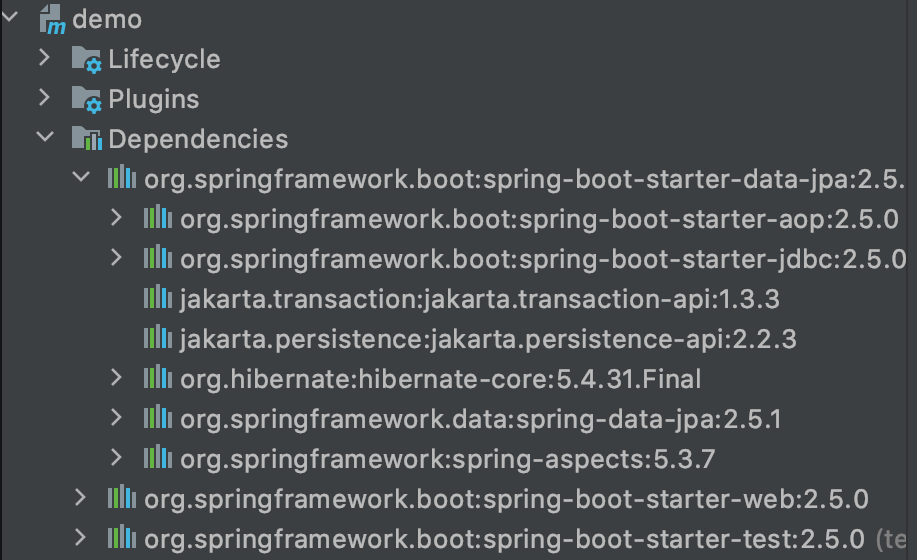

#### `PREVIOUS TOPIC:` [Dependency Management](3_dependency-management.md)
-----
# Spring Boot - Starters [↑](../../../README.md#iv-spring-boot)
- Before Spring Boot was introduced, Spring developers used to spend a lot of time on dependency management. Spring Boot Starters simplify dependency management by bundling commonly used libraries.
- Dependency Management in general, is handled by Spring Boot's dependency management system which uses **Spring Boot BOM (Bill of Materials)**.
- These are dependency descriptors that can be added under the `<dependencies>` section of the **pom.xml**.
- There are 50+ Spring Boot Starters for different spring and related technologies. These starters give all the dependencies under a single name.
  - For example, if there is a need to use the **Spring Data JPA** for database access, the **spring-boot-starter-data-jpa** is included in the dependency.

#### Bookmarks
- [Application Starters](#application-starters-)
- [Production Starters](#production-starter-)
- [Technical Starters](#technical-starters-)

## Advantage of Spring Boot Starters
- Increase productivity by decreasing the configuration time for developers.
- Managing of the POM is easier since the number of dependencies to be added is decreased.
- Tested, production-ready, and supported dependency configuration.
- No need to remember the name and version of the dependencies.

## Sample Implementation

```xml
  <dependencies>
    <dependency>
        <groupId>org.springframework.boot</groupId>
        <artifactId>spring-boot-starter-data-jpa</artifactId>
    </dependency>
</dependencies>
```

This starter dependency gives all the required dependencies and can be see n under the Maven tab in IntelliJ IDEA.

<div align="center"></div>

In earlier days, these dependencies are included in the dependencies individually.

## Third-Party Starters 
If you want to make your own starter or other third-party starters name should not start with spring-boot as it reserved for official Spring Boot Starters. 
It can start with the name of the project. For example, if the name of the project is gfg-code-template, then the name of the starter can be gfg-code-template-spring-boot-starter.

### Application Starters [↑](#spring-boot---starters-)
- `spring-boot-starter`: Core starter, including auto-configuration support, logging, and YAML
- `spring-boot-starter-activemq`: Starter for JMS messaging using Apache ActiveMQ.
- `spring-boot-starter-amqp`: Starter for using Spring AMQP and Rabbit MQ.
- `spring-boot-starter-aop`: Starter for aspect-oriented programming with Spring AOP and AspectJ
- `spring-boot-starter-artemis`: Starter for JMS messaging using Apache Artemis
- `spring-boot-starter-batch`: Starter for using Spring Batch
- `spring-boot-starter-cache`: Starter for using Spring Framework’s caching support
- `spring-boot-starter-data-cassandra`: Starter for using Cassandra distributed database and Spring Data Cassandra
- `spring-boot-starter-data-cassandra-reactive`: Starter for using Cassandra distributed database and Spring Data Cassandra Reactive
- `spring-boot-starter-data-couchbase`: Starter for using Couchbase document-oriented database and Spring Data Couchbase
- `spring-boot-starter-data-elastisearch`: Starter for using Elasticsearch search and analytics engine and Spring Data Elasticsearch
- `spring-boot-starter-data-jdbc`: Starter for using Spring Data JDBC
- `spring-boot-starter-data-jpa`: Starter for using Spring Data JPA with Hibernate
- `spring-boot-starter-data-mongodb`: Starter for using MongoDB document-oriented database and Spring Data MongoDB
- `spring-boot-starter-data-mongodb-reactive`: Starter for using MongoDB document-oriented database and Spring Data MongoDB Reactive
- `spring-boot-starter-groovy-templates`: Starter for building MVC web applications using Groovy Templates views
- `spring-boot-starter-integration`: Starter for using Spring Integration.
- `spring-boot-starter-jdbc`: Starter for using JDBC with the HikariCP connection pool
- `spring-boot-starter-json`: Starter for reading and writing JSON.
- `spring-boot-starter-mail`: For email sending support.
- `sprin-boot-starter-oauth2-client`: Starter for using Spring Security’s OAuth2/OpenID Connect client features
- `spring-boot-starter-oauth2-resource-server`: Starter for using Spring Security’s OAuth2 resource server features
- `spring-boot-starter-security`: Starter for using Spring Security.
- `spring-boot-starter-test`: Starter for testing Spring Boot applications with libraries including JUnit Jupiter, Hamcrest and Mockito
- `spring-boot-starter-web`: Starter for building web, including RESTful, applications using Spring MVC. Uses Tomcat as the default embedded container

### Production Starter [↑](#spring-boot---starters-)
- `spring-boot-starter-actuator`: Starter for using Spring Boot’s Actuator which provides production-ready features to help you monitor and manage your application

### Technical Starters [↑](#spring-boot---starters-)
- `spring-boot-starter-jetty`: Starter for using Jetty as the embedded servlet container. An alternative to spring-boot-starter-tomcat
- `sprint-boot-starter-log4j2`: Starter for using Log4j2 for logging. An alternative to spring-boot-starter-logging.
- `spring-boot-starter-logging`: For using Logback as the logger. Default logging starter.
- `spring-boot-starter-reactor-netty`: Starter for using Reactor Netty as the embedded reactive HTTP server
- `spring-boot-starter-tomcat`: Starter for using Tomcat as the embedded servlet container. Default servlet container starter used by spring-boot-starter-web
- `spring-boot-starter-undertow`: Starter for using Undertow as the embedded servlet container. An alternative to spring-boot-starter-tomcat

-----
#### `NEXT TOPIC:` [Exception Handling](5_exception-handling.md)