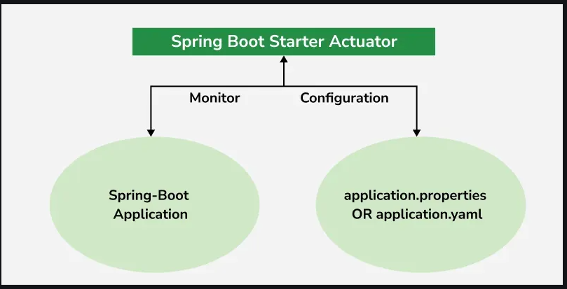

#### `PREVIOUS TOPIC` [Exception Handling](5_exception-handling.md)
-----

# Spring Boot Actuator [↑](../../../README.md#iv-spring-boot)
- Spring Boot provides an **actuator dependency** that can be used to monitor and manage applications.
- Developers can manage their applications easily by **/actuator** and **/actuator/health** endpoints.

<div align="center">

</div>

## Advantages of Actuators
1. Increases customer satisfaction
2. Reduces downtime
3. Boosts productivity
4. Improves Cybersecurity Management
5. Increases the conversion rate.

## Configuration of Actuator
In order to use hibernate validators, these configurations are necessary in Spring Boot applications.

### 1.1. Adding Actuator Dependencies
```xml
<dependencies>
  <dependency>
    <groupId>org.springframework.boot</groupId>
    <artifactId>spring-boot-starter-actuator</artifactId>
  </dependency>
</dependencies>
```

### 1.2. Configuring the Actuator in application.properties
Actuator provides several configuration options to customize its behavior.

#### Changing default endpoints

```text
management.endpoints.web.base-path=/details
```

#### Including IDs/Endpoints
By default, all IDs are set to false except for "health". To include an ID, use the following property
```text
management.endpoint.<id>.enabled
Example -> management.endpoint.metrics.enabled=true
```

#### Listing down all IDs that we want to include (separated by comma)
```text
management.endpoints.web.exposure.include=metrics,info
```

#### Include only metrics and info IDs and will exclude others
```text
management.endpoints.web.exposure.include=*
```
