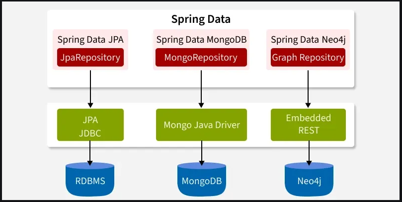

# Spring Data Framework - Introduction [↑](../../../README.md#vii-spring-data-jpa)
Spring Data is a data access framework in the Spring ecosystem that simplifies database interactions for SQL and NoSQL databases.

It eliminates boilerplate code and provides an easy-to-use abstraction layer for developers working with JPA, MongoDB, and more.

**Spring Data Framework** was introduced to bridge the gap between traditional and modern data storage solutions. It provides:
- Unified access to SQL, NoSQL, and Big Data technologies.
- Simplified CRUD operations via repositories.
- Automatic query generation and optimized database interactions.
- Scalable and flexible archhitecture for cloud-based and microservices applications.

## Spring Data Framework Components
Spring Data is a parent project that consists of multiple submodules, each designed for specific database types.

1. Relational Database Support (SQL-based)
    - **Spring Data JPA**: Simplified Hibernate and JPA-based persistence.
    - **Spring Data JDBC**: Direct JDBC access with minimal overhead.
    - **Spring Data R2DBC**: Reactive database access for SQL databases.

2. NoSQL Database Support
    - **Spring Data MongoDB**: Document-oriented database with JSON-based storage.
    - **Spring Data Redis**: In-memory key-value store with caching support.
    - **Spring Data Cassandra**: Highly scalable, distributed NoSQL database.
    - **Spring Data ElasticSearch**: Full-text search and analytics database.
    - **Spring Data Neo4j**: Graph-based database with complex relationship modeling.

3. Big Data Support
    - **Spring Data Hadoop**: Integration with Hadoop ecosystem for large-scale data processing.
    - **Spring Data Hive, Pig, and Cascading**: Support for distributed programming.

## Repositories
A repository is an abstraction layer between domain models and the database. 
It enables CRUD operations without writing SQL queries manually.

#### Steps to use a Repository:
1. Create a POJO entity representing the data model.
2. Extend `JpaRepository`, `CrudRepository`, or `MongoRepository`.
3. Define custom query methods using **Spring Data Query Methods**.
4. Inject the repository into services and use it for database operations.