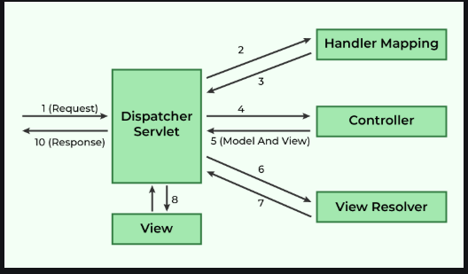

# Spring - MVC Framework [↑](../../../README.md#v-spring-mvc)

- [I.Introduction](#introduction)
- [II. The DispatcherServlet](#the-dispatcherservlet)
- [III. Spring MVC Flow Diagram](#spring-mvc-flow-diagram)
- [IV. Advantages and Disadvantages](#advantages-and-disadvantages)
- [V. Implementation](#creating-a-simple-mvc-application)
    - [1. Add the Dependency](#1-add-the-dependencies)
    - [2. Define the Controller](#2-define-the-controller)
    - [3. Configure the `web.xml`](#3-configure-the-webxml)
    - [4. Define the servlet.xml](#4-define-the-bean-configuration-spring-servletxml)
    - [5. Create the JSP file](#5-create-a-jsp-file)

## Introduction
- Spring MVC follows the **Model-View-Controller** pattern centered around the `FrontController`, `DispatcherServlet`, which routes all HTTP requests to the appropriate controller.
- The `@Controller` annotation marks a class as a controller and `@RequestMapping` annotation maps web requests to specific controller methods.
- The MVC terms are defined as follows:
    - **Model**: Encapsulates the application data
    - **View**: Renders the model data and generates HTML output that the client's browser can interpret
    - **Controller**: Process the user _requests_ and passes them to the view for rendering


## The DispatcherServlet
The central component of Spring MVC:
- Acts as the Front Controller for all HTTP requests.
- Determines the appropriate controller to handle a request.
- Resolves the view using the View Resolver and renders the response.

## Spring MVC Flow Diagram

<div align="center"></div>

- DispatcherServlet intercepts incoming requests.
- Retrieves the handler mapping and forwards the request to the controller
- The controller processes the request and returns a **ModelAndView** Object.
- DispatcherServlet uses the view resolver to render the appropriate view.

## Advantages and Disadvantages

### Advantages
- Uses a lightweight servlet container for thhe development and deployment of applications.
- Enables rapid and parallel development.
- Facilitates fast application development
- Promotes collaboration
- Makes updating of the application easier
- Enhances debugging due to multiple levels in the application.

### Disadvantages
- Has high complexity when developing application using this pattern (xml configuratioon based)
- Not suitable for small applications as it may affect performance and design.

## Creating a simple MVC Application

### 1. Add the dependencies

```xml
<dependencies>
    <!-- Spring Web MVC -->
    <dependency>
        <groupId>org.springframework</groupId>
        <artifactId>spring-webmvc</artifactId>
        <version>5.3.30</version>
    </dependency>

    <!-- Jakarta Servlet API -->
    <dependency>
        <groupId>jakarta.servlet</groupId>
        <artifactId>jakarta.servlet-api</artifactId>
        <version>5.0.0</version>
        <scope>provided</scope>
    </dependency>
</dependencies>
```

### 2. Define the Controller
Create a controller class that will handle the request.

```java
@Controller
public class HelloGeek {

    @RequestMapping("/")
    public String display(Model model) {
        model.addAttribute("message", "Spring MVC Tutorial!!");
        return "index";
    }
}
```

### 3. Configure the web.xml
Specify the DispatcherServlet in the web.xml file.

```xml
<web-app xmlns="http://xmlns.jcp.org/xml/ns/javaee" 
         xmlns:xsi="http://www.w3.org/2001/XMLSchema-instance" 
         xsi:schemaLocation="http://xmlns.jcp.org/xml/ns/javaee 
                             http://xmlns.jcp.org/xml/ns/javaee/web-app_3_0.xsd" 
         version="3.0">

    <display-name>SpringMVC</display-name>

    <servlet>
        <servlet-name>spring</servlet-name>
        <servlet-class>org.springframework.web.servlet.DispatcherServlet</servlet-class>
        <load-on-startup>1</load-on-startup>
    </servlet>

    <servlet-mapping>
        <servlet-name>spring</servlet-name>
        <url-pattern>/</url-pattern>
    </servlet-mapping>

</web-app>
```

### 4. Define the Bean Configuration (spring-servlet.xml)
Place the configuration in WEB-INF to enable component scanning and view resolution:

```xml
<beans xmlns="http://www.springframework.org/schema/beans"
       xmlns:context="http://www.springframework.org/schema/context"
       xmlns:mvc="http://www.springframework.org/schema/mvc"
       xmlns:xsi="http://www.w3.org/2001/XMLSchema-instance"
       xsi:schemaLocation="http://www.springframework.org/schema/beans 
                           http://www.springframework.org/schema/beans/spring-beans.xsd
                           http://www.springframework.org/schema/context 
                           http://www.springframework.org/schema/context/spring-context.xsd
                           http://www.springframework.org/schema/mvc 
                           http://www.springframework.org/schema/mvc/spring-mvc.xsd">

    <context:component-scan base-package="com.geeksforgeeks.controller"/>
    <mvc:annotation-driven/>

    <bean class="org.springframework.web.servlet.view.InternalResourceViewResolver">
        <property name="prefix" value="/WEB-INF/views/"/>
        <property name="suffix" value=".jsp"/>
    </bean>

</beans>
```
- The XML namespaces and schema locations are added.
- `<context:component-scan>` tells Spring where to look for annotated components.
- `<mvc:annotation-driven>` enables Spring MVC annotation.
- The `InternalResourceViewResolver` bean is defined to resolvew view names. It looks for JSP files in the /WEB-INF/view/ directory and appends .jsp to the view name.

### 5. Create a JSP file
The JSP file will display the message passed from the controller
```jsp
<%@ page contentType="text/html; charset=UTF-8" language="java" %>
<!DOCTYPE html>
<html>
<head>
    <title>Spring MVC Example</title>
</head>
<body>
<h2>${message}</h2>
</body>
</html>
```