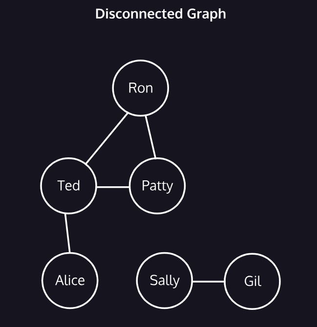
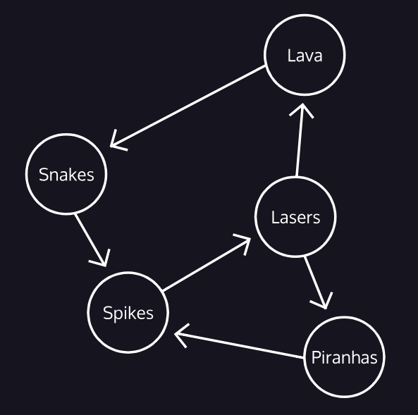

# Graphs Data Structure
- Graphs are perfect data structure for modeling *networks*.
- Graphs are composed of:
  - `vertex`: nodes that holds the data.
  - `edge`: connection between two (2) vertex.
- The higher the ratio of edges to vertices, the more connected the graph.


<div>
  <ul>
    <li>The people are the vertices and the edges are the friendships.</li>
    <li>Ted is <strong>adjacent</strong> to Patty, Ron, and Alice because an edge is directly connects them.</li>
    <li>Friendships are <strong>bidirectional</strong> like Alice-Ted-Ron.</li>
    <li>Sally and Gil are <strong>disconnected</strong> (no path exists between two-vertices.)</li>
  </ul>
</div>

## Weighted Graphs
- Edges has value or a cost associated with traveling between vertices.
- When tallying the cost of the path, edge cost are added up.

## Directed Graphs
- Edges restrict the direction of movement between vertices.
<div align="center">
  
</div>

## Representing Graphs
Graphs are represented in two ways: *adjacency list* or *adjacency matrix*.

### Adjacency Matrix
- The vertex appears as the column (top) as well as the row (side).
- 1 marks an edge, 0 marks an absence of an edge.
- In a weighted graph, the cell contains the cost of that edge.

### Adjacency List
- Each vertex contains a list of the vertices where an edge exist.
```regexp
 A: = > B
 B: = > A, X, P, T
 X: = > B, P
 P: = > X, B
 T: = > B
```

## Implementation
### Java

